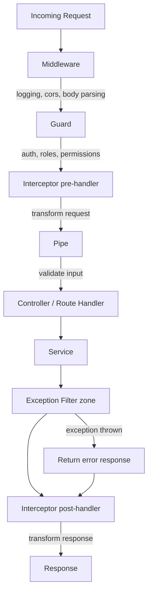

# Node.js Complete Guide (2026)

## Table of Contents

1. [Node.js Fundamentals](#1-nodejs-fundamentals)
2. [Promises](#2-promises)
3. [File System](#3-file-system)
4. [Express.js](#4-expressjs)
5. [MVC Architecture](#5-mvc-architecture)
6. [Template Engine (Pug)](#6-template-engine-pug)
7. [Middlewares](#7-middlewares)
8. [Database (PostgreSQL)](#8-database-postgresql)
9. [NestJS](#9-nestjs)

---

# 1. Node.js Fundamentals

## 1.1 Request Life Cycle

When a user requests 'Google.com', the browser requests 'DNS' (Domain Name System). Then DNS translates/searches for 'Google.com' to the opposite 'IP Address' and makes a request to the server that contains Google's IP address. Then the response is returned to the user browser again with needed files (html page).

## 1.2 REPL (Read Eval Print Loop)

- Interactive Programming Environment
- In terminal, if you write 'node' command, then you can execute any code or mathematic operation

## 1.3 JavaScript vs Node.js

| Feature | JavaScript | Node.js |
|---------|------------|---------|
| Environment | Runs in Web Browsers | Server Side Runtime Environment |
| Execution | Execute in Browser Environment | Executes Outside Browser Environment |
| Threading | Single Threaded | Single Threaded But Supports Async I/O |
| Blocking | Can Block UI Thread | Uses Non Blocking I/O operations |
| Global Object | `window` | `global` |
| Event Loop | Utilizes Browser Event Loop | Utilizes NodeJs Event Loop |
| Package Manager | n/a (Dependency management via npm) | npm |
| Concurrency Model | Based On Async Callbacks | Based On Async Callbacks, Supports Worker Threads, Clusters, etc |

> In Node.js, for example, console comes from 'global' object: `global.console.log("Hello World")`

## 1.4 Node.js Local Server

```bash
npm i --save-dev @types/node
```

Inside `tsconfig.json` add "node" in types array:

```json
{
    "compilerOptions": {
        "types": ["node"]
    }
}
```

Create the server in `index.js`:

```javascript
const http = require('node:http');

const server = http.createServer((req, res) => {
    res.writeHead(200, { "Content-Type": "text/plain" })
    res.end("Hello, There!")
})

server.listen(8000)
```

Run: `node index.js`

## 1.5 CommonJS vs ECMAScript Modules

```javascript
const http = require("node:http") // CommonJS Module

import http from "http" // ECMAScript Module
```

For Node.js, if you want to use 'CommonJS' or 'ESModule' in the project, you can define in `package.json`:

```json
"type": "module"
// or
"type": "commonjs"
```

## 1.6 Compile TypeScript and Response Write

```bash
npm i -g typescript
npx tsc --ignoreConfig index.ts && node index.js
```

Response write example:

```javascript
const http = require('node:http');

const server = http.createServer((req, res) => {
    res.writeHead(200, { "Content-Type": "text/plain" })

    ///// Can Write Many Writes Here //////
    res.write("This Is First One")
    res.write("This Is Second One")

    // Can Only One .end Here
    // And Must Set The End For End The Response Progress
    res.end("Hello, There!")
})

const PORT = 8000
server.listen(PORT)
```

## 1.7 Watching and Sending JSON

```bash
npm i -D typescript ts-node nodemon
```

In `package.json` add the script of run:

```json
{
    "scripts": {
        "start": "node dist/index.js",
        "dev": "nodemon src/index.ts",
        "build": "tsc -p ."
    }
}
```

### Basic Server with Watching

```typescript
import http = require('node:http');

const server = http.createServer((req: http.IncomingMessage, res: http.ServerResponse) => {
    res.writeHead(200, { "Content-Type": "text/plain" });
    res.write("This Is First One\n");
    res.write("This Is Second One\n");
    res.end("Hello, There!");
});

const PORT = 8000;
server.listen(PORT, () => {
    console.log(`Server running on http://localhost:${PORT}`);
});
```

### Send JSON Data

```typescript
import http = require('node:http');

const server = http.createServer((req: http.IncomingMessage, res: http.ServerResponse) => {
    res.writeHead(200, { "Content-Type": "text/plain" });
    const products = [
        { id: 1, name: "first 1" },
        { id: 2, name: "second 2" }
    ]
    res.end(JSON.stringify(products));
});

const PORT = 8000;
server.listen(PORT, () => {
    console.log(`Server running on http://localhost:${PORT}`);
});
```

## 1.8 Routing

```typescript
import http = require('node:http');

const server = http.createServer((req: http.IncomingMessage, res: http.ServerResponse) => {

    // localhost://8000/products
    if (req.url == "/products") {
        res.writeHead(200, { "content-type": "application/json" });
        const products = [
            { id: 1, name: "first 1" },
            { id: 2, name: "second 2" }
        ]
        res.write(JSON.stringify(products))
        res.end();
    } 
    // localhost://8000/
    else if (req.url == "/") {
        res.writeHead(200, { "content-type": "text/plain" })
        res.write("Home Page")
        res.end()
    } 
    // For Any Unknown route
    else {
        res.writeHead(400, { "content-type": "text/html" })
        res.write("<h1>404 NOT FOUND</h1>")
        res.end()
    }
});

const PORT = 8000;
server.listen(PORT, () => {
    console.log(`Server running on http://localhost:${PORT}`);
});
```

### Formatting Products with Any Format

```typescript
// localhost://8000/products
if (req.url == "/products") {
    res.writeHead(200, { "content-type": "application/json" });
    const data = {
        products: [
            { id: 1, name: "first 1" },
            { id: 2, name: "second 2" }
        ]
    }
    res.write(JSON.stringify(data))
    res.end();
}
```

## 1.9 Fetch Params and Add New Product

```typescript
import http = require('node:http');

const server = http.createServer((req: http.IncomingMessage, res: http.ServerResponse) => {
    // 1. Show the add product form
    if (req.url === '/products/add' && req.method === 'GET') {
        res.writeHead(200, { 'content-type': 'text/html' });
        res.write(`
    <h1>Add New Product</h1>
    <form method="POST" action="/products/add">
        <label>Name:</label><br/>
        <input type="text" name="name" required /><br/><br/>
        <button type="submit">Add Product</button>
    </form>
    `);
        res.end();
    }

    // 2. Receive form data from the request body
    else if (req.url === '/products/add' && req.method === 'POST') {
        let body = '';

        // 3. Collect incoming data chunks
        req.on('data', (chunk) => {
            body += chunk.toString();
        });

        // 4. Parse and respond when all data is received
        req.on('end', () => {
            const params = new URLSearchParams(body);
            const name = params.get('name');
            res.writeHead(200, { 'content-type': 'text/html' });
            res.write(`
        <h1>Product Added Successfully!</h1>
        <p>Product <strong>${name}</strong> has been added.</p>
        <a href="/products">Back to Products</a> |
        <a href="/products/add">Add Another</a>
    `);
            res.end();
        });
    }

    else {
        res.writeHead(404, { 'content-type': 'text/html' });
        res.write('<h1>404 NOT FOUND</h1>');
        res.end();
    }
});

const PORT = 8000;
server.listen(PORT, () => {
    console.log(`Server running on http://localhost:${PORT}`);
});
```

---

# 2. Promises

## 2.1 Promise Syntax

```javascript
// 1- Promise Constructor
// 2- This Will Return A Promise Object
// 3- The Function That Takes Two Parameters (Resolve , Reject) Called Executor Function
const myPromise = new Promise((resolve, reject) => {

})
```

## 2.2 Create First Promise and Access Fulfilled Promise Data

```javascript
const fetchUser = async () => {
    return new Promise((resolve, reject) => {
        setTimeout(() => {
            resolve({ id: 1, name: "John Doe" })
        }, 3000)
    })
}

// 1- First Way To Handle Promise (Async/Await)
const res = await fetchUser()
console.log(res) // { id: 1, name: "John Doe" }

// 2- Second Way To Handle Promise (Then/Catch)
fetchUser().then(user => {
    console.log(user) // { id: 1, name: "John Doe" }
}).catch(error => {
    console.error(error)
})

// 3- Third Way To Handle Promise
const onSuccess = user => {
    console.log(user)
}

const onError = (error) => {
    console.error(error)
}

fetchUser().then(onSuccess, onError)
```

## 2.3 Ways of Handle Promise Error

```javascript
const fetchUser = async (id) => {

    // 1- Create a list of users (simulate a database)
    const userList = Array.from({ length: 100 }, (_, idx) => ({ id: idx + 1, name: `User ${idx + 1}` }))


    return new Promise((resolve, reject) => {
        setTimeout(() => {

            // 2- Check if the user exists in the list
            if (id > userList.length) {
                // If the user does not exist, reject the promise with an error message
                reject(new Error("User not found"))
                return
            }

            // 3- If the user exists, resolve the promise with the user data
            const user = userList.find(user => user.id === id)
            resolve(user)
        }, 3000)
    })
}

// 1- First Way To Handle Promise Error
try {
    const res = await fetchUser(444)
    console.log(res) // { id: 1, name: "John Doe" }
} catch (error) {
    console.error(error)
}

// 2- Second Way To Handle Promise Error
fetchUser(222).then(user => {
    console.log(user) // { id: 1, name: "John Doe" }
}).catch(error => {
    console.error(error)
})


// 3- Third Way To Handle Promise Error
const onSuccess = user => {
    console.log(user)
}

const onError = (error) => {
    console.error(error)
}

fetchUser(555).then(onSuccess, onError)
```

## 2.4 Handle Reject for All Syntaxes

```javascript
const fetchUser = async (id) => {
    const userList = Array.from({ length: 100 }, (_, idx) => ({ id: idx + 1, name: `User ${idx + 1}` }))

    return new Promise((resolve, reject) => {
        setTimeout(() => {
            if (id > userList.length) {
                reject(new Error("User not found"))
                return
            }
            const user = userList.find(user => user.id === id)
            resolve(user)
        }, 3000)
    })
}

// 1- First Way To Handle Promise Error
try {
    const res = await fetchUser(444)
    console.log(res)
} catch (error) {
    console.error(error)
}

// 2- Second Way To Handle Promise Error
fetchUser(222).then(user => {
    console.log(user)
}).catch(error => {
    console.error(error)
})

// 3- Third Way To Handle Promise Error
const onSuccess = user => {
    console.log(user)
}

const onError = (error) => {
    console.error(error)
}

fetchUser(555).then(onSuccess, onError)
```

## 2.5 Finally With All Syntaxes

```javascript
const fetchUser = async (id) => {
    const userList = Array.from({ length: 100 }, (_, idx) => ({ id: idx + 1, name: `User ${idx + 1}` }))

    return new Promise((resolve, reject) => {
        setTimeout(() => {
            if (id > userList.length) {
                reject(new Error("User not found"))
                return
            }
            const user = userList.find(user => user.id === id)
            resolve(user)
        }, 3000)
    })
}

// 1- First Way To Handle Promise Error
try {
    const res = await fetchUser(2)
    console.log(res)
} catch (error) {
    console.error(error)
} finally {
    console.log("Fetch user operation completed")
}

// 2- Second Way To Handle Promise Error
fetchUser(4).then(user => {
    console.log(user)
}).catch(error => {
    console.error(error)
}).finally(() => {
    console.log("Fetch user operation completed")
})

// 3- Third Way To Handle Promise Error
const onSuccess = user => {
    console.log(user)
}

const onError = (error) => {
    console.error(error)
}

fetchUser(5).then(onSuccess, onError).finally(() => {
    console.log("Fetch user operation completed")
})
```

## 2.6 Promise.race()

Returns a promise that fulfills or rejects as soon as one of the promises in the iterable fulfills or rejects with the value or reason from that promise.

### Success Case

```javascript
const onPromisesRace = () => {
    const promise1 = new Promise((resolve, reject) => setTimeout(resolve, 5000, "Promise 1 Resolved"))
    const promise2 = new Promise((resolve, reject) => setTimeout(resolve, 3000, "Promise 2 Resolved"))

    return Promise.race([promise1, promise2])
}

onPromisesRace().then(result => console.log(result)) // "Promise 2 Resolved"
```

### Failure Case

```javascript
const onPromisesRaceReject = (userId) => {
    
    const promise1 = new Promise((resolve, reject) => {
        if (userId > 100) {
            reject(new Error("User not found"))
            return
        }
        setTimeout(resolve, 1000, "Promise 1 Resolved")
    })

    const promise2 = new Promise((resolve, reject) => {
        if (userId > 100) {
            reject(new Error("User not found."))
            return
        }
        setTimeout(resolve, 3000, "Promise 2 Resolved")
    })

    return Promise.race([promise1, promise2])
}

onPromisesRaceReject(101).then(result => console.log(result)) // User not found
```

## 2.7 Promise.all()

Returns an array of values from the fulfilled promises or throws an error from the failed promise.

### All Succeeded Case

```javascript
const onPromisesAll = () => {
    const promise1 = new Promise((resolve, reject) => setTimeout(resolve, 5000, "Promise 1 Resolved"))
    const promise2 = new Promise((resolve, reject) => setTimeout(resolve, 3000, "Promise 2 Resolved"))

    return Promise.all([promise1, promise2])
}

onPromisesAll().then(console.log) // [ 'Promise 1 Resolved', 'Promise 2 Resolved' ]
```

### Failure Case

```javascript
const onPromisesAll = () => {
    const promise1 = new Promise((resolve, reject) => setTimeout(reject, 5000, "Promise 1 Rejected"))
    const promise2 = new Promise((resolve, reject) => setTimeout(resolve, 3000, "Promise 2 Resolved"))

    return Promise.all([promise1, promise2])
}

onPromisesAll().then(console.log, console.error) // Promise 1 Rejected
```

## 2.8 Promise.any()

Returns any fulfilled promise result.

```javascript
const promisesWithAny = () => {
    const promise1 = new Promise((resolve, reject) => setTimeout(reject, 1000, "Promise 1 Resolved"))
    const promise2 = new Promise((resolve, reject) => setTimeout(resolve, 3000, "Promise 2 Resolved"))

    return Promise.any([promise1, promise2])
}

promisesWithAny().then(console.log).catch(console.error) // Promise 2 Resolved
```

## 2.9 Async/Await and Error Handling using try/catch

Special syntax to work with promises.

```javascript
const fetchUser = async (id) => {
    const userList = Array.from({ length: 100 }, (_, idx) => ({ id: idx + 1, name: `User ${idx + 1}` }))

    return new Promise((resolve, reject) => {
        setTimeout(() => {
            if (id > userList.length) {
                reject(new Error("User not found"))
                return
            }
            const user = userList.find(user => user.id === id)
            resolve(user)
        }, 3000)
    })
}


try {
    const res = await fetchUser(2)
    console.log(res) // Output: { id: 2, name: 'User 2' }
} catch (error) { 
    console.error(error)
} finally {
    console.log("Fetch user operation completed")
}
```

---

# 3. File System

## 3.1 Read File Async

```typescript
import http = require('node:http');
import fs = require('node:fs')

const server = http.createServer((req: http.IncomingMessage, res: http.ServerResponse) => {

    if (req.url === '/products' && req.method === 'GET') {

        // This Is Async Which Is Non Blocking Code
        fs.readFile('./src/data/products.json', 'utf8', (err, data) => {
            res.writeHead(200, { 'content-type': 'application/json' });
            const content = data
            console.log(JSON.parse(content)) // Will Printed At End
            res.write(content);
            res.end();
        })

        console.log("The Endddddd") // Will Printed First
    }

    else {
        res.writeHead(404, { 'content-type': 'text/html' });
        res.write('<h1>404 NOT FOUND</h1>');
        res.end();
    }
});

const PORT = 8000;
server.listen(PORT, () => {
    console.log(`Server running on http://localhost:${PORT}`);
});
```

## 3.2 Module Path

For writing better and absolute paths:

```typescript
import http = require('node:http');
import fs = require('node:fs')
import path = require('node:path');

const server = http.createServer((req: http.IncomingMessage, res: http.ServerResponse) => {

    if (req.url === '/products' && req.method === 'GET') {

        // 1- Create products.json path (/node_first_project/src/data/products.json)
        const product_path = path.join(__dirname, "data", "products.json")

        fs.readFile(product_path, 'utf8', (err, data) => {
            res.writeHead(200, { 'content-type': 'application/json' });
            const content = data
            console.log(JSON.parse(content)) 
            res.write(content);
            res.end();
        })
    }

    else {
        res.writeHead(404, { 'content-type': 'text/html' });
        res.write('<h1>404 NOT FOUND</h1>');
        res.end();
    }
});

const PORT = 8000;
server.listen(PORT, () => {
    console.log(`Server running on http://localhost:${PORT}`);
});
```

## 3.3 File System Exception Handler

```typescript
import http = require('node:http');
import fs = require('node:fs')
import path = require('node:path');

const server = http.createServer((req: http.IncomingMessage, res: http.ServerResponse) => {

    if (req.url === '/products' && req.method === 'GET') {

        // 1- Create products.json path
        const product_path = path.join(__dirname, "data", "products.json1")

        // 2- Use '.access' For Check If File Exists Or Not
        fs.access(product_path, (err) => {
            if (err) {
                res.writeHead(200, { 'content-type': 'text/plain' });
                res.end('File not found');
                return
            }

            else {
                fs.readFile(product_path, 'utf8', (err, data) => {
                    res.writeHead(200, { 'content-type': 'application/json' });
                    const content = data
                    res.write(content);
                    res.end();
                })
            }
        })
    }
    else {
        res.writeHead(404, { 'content-type': 'text/html' });
        res.write('<h1>404 NOT FOUND</h1>');
        res.end();
    }
});

const PORT = 8000;
server.listen(PORT, () => {
    console.log(`Server running on http://localhost:${PORT}`);
});
```

## 3.4 Write To File

```typescript
import http = require('node:http');
import fs = require('node:fs')
import path = require('node:path');

const server = http.createServer((req: http.IncomingMessage, res: http.ServerResponse) => {

    if (req.url === '/products' && req.method === 'GET') {

        // 1- Create products.json path
        const product_path = path.join(__dirname, "data", "products.json")

        // 2- Use '.access' For Check If File Exists Or Not
        fs.access(product_path, (err) => {
            if (err) {
                res.writeHead(200, { 'content-type': 'text/plain' });
                res.end('File not found');
                return
            }

            else {
                // Write To File
                fs.writeFile(
                    product_path,
                    JSON.stringify({
                        "products": [
                            { id: 3, name: "product3" }
                        ]
                    }, null, 2),
                    { flag: 'w' },
                    (err) => {
                        console.log(err)
                    })

                // Read File And Send It To Client
                fs.readFile(product_path, 'utf8', (err, data) => {
                    res.writeHead(200, { 'content-type': 'application/json' });
                    const content = data
                    res.write(content);
                    res.end();
                })
            }
        })
    }
    else {
        res.writeHead(404, { 'content-type': 'text/html' });
        res.write('<h1>404 NOT FOUND</h1>');
        res.end();
    }
});

const PORT = 8000;
server.listen(PORT, () => {
    console.log(`Server running on http://localhost:${PORT}`);
});
```

## 3.5 Append Data to JSON File from HTML Form

```typescript
import http = require('node:http');
import fs = require('node:fs')
import path = require('node:path');

// 1- Create Function For Check File Exists
const checkFileExist = (filePath: string) => {
    try {
        fs.accessSync(filePath)
        return true
    } catch {
        return false
    }
}

const formattedResponse = (res: http.ServerResponse, statusCode: number, contentType: string, message?: string) => {
    res.writeHead(statusCode, { 'content-type': contentType });
    res.end(message);
}

const server = http.createServer((req: http.IncomingMessage, res: http.ServerResponse) => {
    const product_path = path.join(__dirname, "data", "products.json")

    // 2- Fetch Products And Display In '/products' Route
    if (req.url === '/products' && req.method === 'GET') {

        if (checkFileExist(product_path)) {
            fs.readFile(product_path, 'utf8', (err, data) => {
                const content = data
                formattedResponse(res, 200, 'application/json', content)
            })
        } else {
            formattedResponse(res, 200, 'text/plain', 'File not found')
            return
        }
    }

    // 3- Form To Submit New Product
    else if (req.url === '/products/add' && req.method === 'GET') {

        formattedResponse(res, 200, 'text/html', `
    <h1>Add New Product</h1>
    <form method="POST" action="/products/add">
        <label>Name:</label><br/>
        <input type="text" name="name" required /><br/><br/>
        <label>Description:</label><br/>
        <textarea name="description" required></textarea><br/><br/>
        <button type="submit">Add Product</button>
    </form>
    `)
    }

    // 4- Receive The POST Request That Incomes From The Form
    // Then Read The File Data And Store New Product
    else if (req.url === '/products/add' && req.method === 'POST') {
        let body = '';

        req.on('data', (chunk) => {
            body += chunk.toString();
        });

        req.on('end', () => {
            const params = new URLSearchParams(body);
            const name = params.get('name');
            const description = params.get('description');

            const is_products_file_exist = checkFileExist(product_path)

            if (is_products_file_exist) {
                const newProduct = {
                    id: Math.floor(Math.random() * 1000000),
                    name,
                    description
                }

                fs.readFile(product_path, 'utf8', (err, data) => {
                    let parsedProducts = [];

                    // check if data exists and is valid JSON
                    if (data) {
                        try {
                            const parsed = JSON.parse(data);
                            parsedProducts = parsed.products ?? [];
                        } catch {
                            parsedProducts = [];
                        }
                    }

                    parsedProducts.push(newProduct);

                    fs.writeFile(product_path, JSON.stringify({ products: parsedProducts }, null, 2), { flag: 'w' }, (err) => {
                        if (err) {
                            formattedResponse(res, 500, 'text/plain', 'Failed to save product');
                            return;
                        }
                        formattedResponse(res, 200, 'text/html', `<a href='/products'>View Products</a>`);
                    });
                });
            }
            else {
                formattedResponse(res, 404, 'text/plain', 'Products File Not Exists')
            }
        });
    }
    else {
        formattedResponse(res, 404, 'text/html', '<h1>404 NOT FOUND</h1>')
    }
});

const PORT = 8000;
server.listen(PORT, () => {
    console.log(`Server running on http://localhost:${PORT}`);
});
```

## 3.6 Use Promises to Read/Write Files

Uses `fs.promises.readFile` / `fs.promises.writeFile` to prevent usage of callbacks.

```typescript
import http = require('node:http');
import fs = require('node:fs')
import path = require('node:path');

const checkFileExist = (filePath: string) => {
    try {
        fs.accessSync(filePath)
        return true
    } catch {
        return false
    }
}

const formattedResponse = (res: http.ServerResponse, statusCode: number, contentType: string, message?: string) => {
    res.writeHead(statusCode, { 'content-type': contentType });
    res.end(message);
}

const server = http.createServer(async (req: http.IncomingMessage, res: http.ServerResponse) => {
    const product_path = path.join(__dirname, "data", "products.json")

    if (req.url === '/products' && req.method === 'GET') {

        if (checkFileExist(product_path)) {
            const jsonData = await fs.promises.readFile(product_path, 'utf8');
            const content = jsonData
            formattedResponse(res, 200, 'application/json', content)
        } else {
            formattedResponse(res, 200, 'text/plain', 'File not found')
            return
        }
    }

    else if (req.url === '/products/add' && req.method === 'GET') {
        formattedResponse(res, 200, 'text/html', `
    <h1>Add New Product</h1>
    <form method="POST" action="/products/add">
        <label>Name:</label><br/>
        <input type="text" name="name" required /><br/><br/>
        <label>Description:</label><br/>
        <textarea name="description" required></textarea><br/><br/>
        <button type="submit">Add Product</button>
    </form>
    `)
    }

    else if (req.url === '/products/add' && req.method === 'POST') {
        let body = '';

        req.on('data', (chunk) => {
            body += chunk.toString();
        });

        req.on('end', async () => {
            const params = new URLSearchParams(body);
            const name = params.get('name');
            const description = params.get('description');

            const is_products_file_exist = checkFileExist(product_path)

            if (is_products_file_exist) {

                // 1- Read File Using fs.promises Without Callback
                const jsonData = await fs.promises.readFile(product_path, 'utf8')

                let parsedProducts = [];

                // 2- check if data exists and is valid JSON
                if (jsonData) {
                    try {
                        const parsed = JSON.parse(jsonData);
                        parsedProducts = parsed.products ?? [];
                    } catch {
                        parsedProducts = [];
                    }
                }

                // 3- Create New Product Obj
                const newProduct = {
                    id: parsedProducts.length + 1,
                    name,
                    description
                }
                parsedProducts.push(newProduct);

                // 4- Use fs.promises with write file too
                await fs.promises.writeFile(product_path, JSON.stringify({ products: parsedProducts }, null, 2), { flag: 'w' });

                formattedResponse(res, 200, 'text/html', `<a href='/products'>View Products</a>`);
            }
            else {
                formattedResponse(res, 404, 'text/plain', 'Products File Not Exists')
            }
        });
    }
    else {
        formattedResponse(res, 404, 'text/html', '<h1>404 NOT FOUND</h1>')
    }
});

const PORT = 8000;
server.listen(PORT, () => {
    console.log(`Server running on http://localhost:${PORT}`);
});
```

## 3.7 Read/Delete Files in Directory

### Read Files in Directory

```typescript
import http = require('node:http');
import fs = require('node:fs')
import path = require('node:path');

const checkFileExist = (filePath: string) => {
    try {
        fs.accessSync(filePath)
        return true
    } catch {
        return false
    }
}

const formattedResponse = (res: http.ServerResponse, statusCode: number, contentType: string, message?: string) => {
    res.writeHead(statusCode, { 'content-type': contentType });
    res.end(message);
}

const server = http.createServer(async (req: http.IncomingMessage, res: http.ServerResponse) => {
       if (req.url === '/assets') {
            const assetsPath = path.join(__dirname, 'assets');
            const is_assets_exist = checkFileExist(assetsPath)

            if (is_assets_exist) {
                const files = fs.readdirSync(assetsPath);

                const listItems = files.map(file => `<li style='margin-top:12px'>
                        
                        <a href='/delete?file=${encodeURIComponent(file)}'>${file}</a>
                        
                        </li>`).join('');

                formattedResponse(res, 200, 'text/html', `
                        <h1>Assets</h1>
                        <ul>${listItems}</ul>
                    `)

            } else {
                formattedResponse(res, 404, 'text/html', '<h1>Folder Not Found</h1>')
            }
        }
        else {
            formattedResponse(res, 404, 'text/html', '<h1>404 NOT FOUND</h1>')
        }
});

const PORT = 8000;
server.listen(PORT, () => {
    console.log(`Server running on http://localhost:${PORT}`);
});
```

### Delete The File

```typescript
import http = require('node:http');
import fs = require('node:fs')
import path = require('node:path');
const assetsPath = path.join(__dirname, 'assets');

const checkFileExist = (filePath: string) => {
    try {
        fs.accessSync(filePath)
        return true
    } catch {
        return false
    }
}

const formattedResponse = (res: http.ServerResponse, statusCode: number, contentType: string, message?: string) => {
    res.writeHead(statusCode, { 'content-type': contentType });
    res.end(message);
}

const server = http.createServer(async (req: http.IncomingMessage, res: http.ServerResponse) => {

    if (req.url === '/assets') {
        const is_assets_exist = checkFileExist(assetsPath)

        if (is_assets_exist) {
            const files = fs.readdirSync(assetsPath);

            const listItems = files.map(file => `<li style='margin-top:12px'>
                
                <a href='/delete?file=${encodeURIComponent(file)}'>${file}</a>
                
                </li>`).join('');

            formattedResponse(res, 200, 'text/html', `
                <h1>Assets</h1>
                <ul>${listItems}</ul>
            `)

        } else {
            formattedResponse(res, 404, 'text/html', '<h1>Folder Not Found</h1>')
        }
    }
    else if (req.method == 'GET' && req.url?.startsWith('/delete')) {

        // Add safety checks for each step
        const queryString = req.url.split('?')[1];
        if (queryString) {
            const fileParam = queryString.split('=')[1];
            if (fileParam) {
                const fileName = decodeURIComponent(fileParam);
                const filePath = path.join(__dirname, '/assets', `/${fileName}`)

                if (checkFileExist(filePath)) {
                    fs.unlink(filePath, err => {
                        if (err) {
                            formattedResponse(res, 404, 'text/plain', `${err}`)
                            return
                        }
                        formattedResponse(res, 200, 'text/plain', 'File Deleted Successfully')
                    })
                } else {
                    formattedResponse(res, 404, 'text/plain', 'File Not Exists')
                }
            } else {
                res.writeHead(400, { "content-type": "text/plain" });
                res.end('Error: No file parameter provided');
            }
        } else {
            res.writeHead(400, { "content-type": "text/plain" });
            res.end('Error: Invalid URL format');
        }
    }
    else {
        formattedResponse(res, 404, 'text/html', '<h1>404 NOT FOUND</h1>')
    }
});

const PORT = 8000;
server.listen(PORT, () => {
    console.log(`Server running on http://localhost:${PORT}`);
});
```

---

# 4. Express.js

## 4.1 Express Intro

Express.js is a minimalist web application framework for Node.js. It provides a set of features for building web and mobile apps. Designed to be lightweight, flexible and unopinionated (with no architecture), allowing developers to create server-side apps quickly and efficiently.

### Key Features

- **Routing**: For defining routes and handling HTTP requests
- **Middleware**: Functions that have access to request and response objects and can modify/terminate the request/response cycle
- **Template engines**
- **Error Handling**
- **Static File Serving**
- **RESTful Routing**
- **Session Management**
- **Middleware Customization**

## 4.2 Setup the Server

```bash
npm i express @types/express
```

Create `server.ts`:

```typescript
import express from "express" // In package.json change 'type' To "module"

const app = express()

// Here Can Pass PORT Previous The Callback Function
app.listen(() => {
    console.log(`Server Started At http://localhost:5000`)
})
```

Change the 'dev' command in `package.json`:

```json
"scripts": {
    "dev": "nodemon src/server.ts",
    "build": "tsc -p ."
}
```

## 4.3 Sending Response

```typescript
import express from "express"

const app = express()

app.get('/', (req, res) => {
    res.send('<h1>Hello Home Page</h1>')
})

const PORT = 3000
app.listen(PORT, () => {
    console.log(`Server Started At http://localhost:${PORT}`)
})
```

## 4.4 REST and Routing

REST (Representational State Transfer) is the most commonly used architectural style for building web services and APIs.

```typescript
import express, { type Request, type Response } from "express"

const app = express()

app.get('/', (req, res) => {
    res.send('<h1>Hello Home Page</h1>')
})

app.get('/products', (req: Request, res: Response) => {
    res.send([
        { id: 1, name: "Blue T-shirt" }
    ])
})

// Dynamic Url
app.get('/products/:id', (req: Request, res: Response) => {
    res.send(req.params.id)
})

const PORT = 3000
app.listen(PORT, () => {
    console.log(`Server Started At http://localhost:${PORT}`)
})
```

## 4.5 Route Params

```typescript
import express, { type Request, type Response } from "express"

const app = express()

// Dynamic Url
app.get('/products/:id', (req: Request, res: Response) => {
    const productId = req.params.id;

    if (productId && isNaN(+productId)) {
        res.status(404).send({ code: 404, message: "Product id not valid" })
        return
    }

    res.status(200).send({
        code: 200,
        data: { id: 1, name: "Blue T-shirt" }
    })
})

const PORT = 3000
app.listen(PORT, () => {
    console.log(`Server Started At http://localhost:${PORT}`)
})
```

## 4.6 Generate Fake Products

```bash
npm install @faker-js/faker --save-dev
```

### utils/fakeData.ts

```typescript
import { faker } from '@faker-js/faker';

export const generatesFakeProducts = () => {
    return Array.from({ length: 25 }, (_, idx) => {
        return {
            id: idx + 1,
            title: faker.commerce.productName(),
            price: +faker.commerce.price()
        }
    })
}
```

### server.ts

```typescript
import express, { type Request, type Response } from "express"
import { generatesFakeProducts } from "./utils/fakeData.js";

const app = express()

// Generates Fake Products
const fakeProducts = generatesFakeProducts()

app.get('/products/:id', (req: Request, res: Response) => {
    const productId = req.params.id;

    if (productId && isNaN(+productId)) {
        res.status(404).send({ code: 404, message: "Product id not valid" }).end()
    }

    // Filter The Products Depending On The ID
    const findProduct = fakeProducts.find(product => product.id == +productId)

    if (findProduct) {
        res.status(200).send({
            code: 200,
            data: findProduct
        }).end()
    } else {
        res.status(404).send({
            code: 404,
            data: null
        })
    }
})

// Return All Generated Products
app.get('/products', (req: Request, res: Response) => {
    res.status(200).send({ code: 200, data: fakeProducts }).end()
})

const PORT = 3000
app.listen(PORT, () => {
    console.log(`Server Started At http://localhost:${PORT}`)
})
```

## 4.7 Query Params

Query params allow returning specific keys from API: `localhost:3000/products?filter=title,price`

### First Shape

```typescript
// localhost:3000/products?filter=title,price
app.get('/products', (req: Request, res: Response) => {
    const query = req.query
    console.log(query) // { filter: 'title,price' }
    res.status(200).send({ code: 200, data: fakeProducts }).end()
})
```

### Second Shape

```typescript
// http://localhost:3000/products?filter=title&filter=price
app.get('/products', (req: Request, res: Response) => {
    const query = req.query
    console.log(query) // { filter: [ 'title', 'price' ] }
    res.status(200).send({ code: 200, data: fakeProducts }).end()
})
```

### Return Products with Specific Keys

```typescript
import express, { type Request, type Response } from "express"
import { generatesFakeProducts } from "./utils/fakeData.ts";
import type { Product } from "./interfaces/index.js";

const app = express()
const fakeProducts = generatesFakeProducts()

app.get('/products', (req: Request, res: Response) => {
    const query = req.query.filter as string

    // If Request Something Like http://localhost:3000/products?filter=title,price
    if (query) {
        const propertiesToFilter = query.split(',')
        let filteredProducts: any = []

        // Filter The Products To Return The Products With Specific Required Props
        filteredProducts = fakeProducts.map(product => {
            let filteredProduct: any = {}
            propertiesToFilter.forEach(property => {
                if (property in product) {
                    filteredProduct[property] = product[property as keyof Product]
                }
            })
            return filteredProduct
        })

        // If User Request http://localhost:3000/products Return Normal All Products
        res.status(200).send({ code: 200, data: filteredProducts }).end()
    }

    res.status(200).send({ code: 200, data: fakeProducts }).end()
})

const PORT = 3000
app.listen(PORT, () => {
    console.log(`Server Started At http://localhost:${PORT}`)
})
```

## 4.8 POST Request with Parsing the Request

```typescript
import express, { type Request, type Response } from "express"

const app = express()

// Make Parse Here For Enable Access 'req' In The Next Request
app.use(express.json())

app.post('/products', (req: Request, res: Response) => {

    // Here Can Access the req and any prop in it
    console.log(req.body)
    res.send(JSON.stringify(req.body)).end()
})

const PORT = 3000
app.listen(PORT, () => {
    console.log(`Server Started At http://localhost:${PORT}`)
})
```

> Can test the POST request by using 'Thunder Client' extension in VS Code.

## 4.9 Parsing Custom Headers

If user sets the header 'Content-Type' with anything other than 'application/json', we can't access the req or will get 'req' object as empty.

So we specify the header 'content-type' - if the client (front end) sends it with the specified value, we will get the 'req' correctly.

```typescript
import express, { type Request, type Response } from "express"

const app = express()

// Here The Client 'Front End' Must Set The content-type with 'custom/header' For Enable Access The 'req' in app.post
app.use(express.json({
    type: 'custom/header' // Default Value Is 'application/json'
}))

app.post('/products', (req: Request, res: Response) => {

    // Will Success To Access With It's Values If content-type is 'custom/header'
    console.log(req.body)
    res.send(JSON.stringify(req.body)).end()
})

const PORT = 3000
app.listen(PORT, () => {
    console.log(`Server Started At http://localhost:${PORT}`)
})
```

## 4.10 Store the New Product

Can test using 'Thunder Client' by making a POST request first then create a GET request.

```typescript
import express, { type Request, type Response } from "express"
import { generatesFakeProducts } from "./utils/fakeData.ts";
import type { Product } from "./interfaces/index.js";

const app = express()
const fakeProducts = generatesFakeProducts()

app.use(express.json({
    type: 'custom/header'
}))

app.post('/products', (req: Request, res: Response) => {
    // Access Req Body Or Data Of New Product
    const newProduct = req.body

    // Push The New Product
    fakeProducts.push({ id: fakeProducts.length + 1, ...newProduct })

    // Note Here 201 Code For Establish Creation
    res.status(201).send(JSON.stringify(req.body)).end()
})

app.get('/products', (req: Request, res: Response) => {
    res.status(200).send({ code: 200, data: fakeProducts }).end()
})

const PORT = 3000
app.listen(PORT, () => {
    console.log(`Server Started At http://localhost:${PORT}`)
})
```

## 4.11 PUT vs PATCH

- **PUT (Full Update / Replace)**: Used to replace the entire resource. You must send all fields. Missing fields may get removed.
- **PATCH (Partial Update)**: Used to update part of a resource. You send only the fields you want to change. Other fields stay unchanged.

## 4.12 Patch an Existing Record

```typescript
import express, { type Request, type Response } from "express"
import { generatesFakeProducts } from "./utils/fakeData.ts";
import type { Product } from "./interfaces/index.js";

const app = express()
const fakeProducts = generatesFakeProducts()

app.use(express.json())

app.post('/products', (req: Request, res: Response) => {
    const newProduct = req.body
    fakeProducts.push({ id: fakeProducts.length + 1, ...newProduct })
    res.status(201).send(JSON.stringify(req.body)).end()
})

app.get('/products', (req: Request, res: Response) => {
    const query = req.query.filter as string

    if (query) {
        const propertiesToFilter = query.split(',')
        let filteredProducts: any = []

        filteredProducts = fakeProducts.map(product => {
            let filteredProduct: any = {}
            propertiesToFilter.forEach(property => {
                if (property in product) {
                    filteredProduct[property] = product[property as keyof Product]
                }
            })
            return filteredProduct
        })

        res.status(200).send({ code: 200, data: filteredProducts }).end()
    }

    res.status(200).send({ code: 200, data: fakeProducts }).end()
})

///////////////////////// Patch /////////////////////////
app.patch('/products/:id', (req: Request, res: Response) => {
    const productId = req.params.id

    // 1- Check If id Sended In Endpoint
    if (productId) {

        // 2- If Is Not A Number Return Error
        if (isNaN(+productId)) {
            return res.status(404).send({
                message: 'Invalid Product Id',
                code: 404
            })
        }

        // 3- Else Find The Product Index Using Id And Access Request Body To Update
        const productIndex = fakeProducts.findIndex(item => item.id === +productId)
        const productBody = req.body

        // 4- If Product Exists Start To Update The Data
        if (productIndex !== -1) {
            fakeProducts[productIndex] = { ...fakeProducts[productIndex], ...productBody }

            return res.status(200).send({
                message: 'Product Updated Successfully',
                code: 200
            })
        } 
        
        // 5- Else Return Not Found Error
        else {
            return res.status(400).send({
                message: 'Product Not Found',
                code: 400
            })
        }
    }
})

const PORT = 3000
app.listen(PORT, () => {
    console.log(`Server Started At http://localhost:${PORT}`)
})
```

## 4.13 Delete Record

```typescript
import express, { type Request, type Response } from "express"
import { generatesFakeProducts } from "./utils/fakeData.ts";
import type { Product } from "./interfaces/index.js";

const app = express()
let fakeProducts = generatesFakeProducts()

app.use(express.json())

app.get('/products', (req: Request, res: Response) => {
    const query = req.query.filter as string

    if (query) {
        const propertiesToFilter = query.split(',')
        let filteredProducts: any = []

        filteredProducts = fakeProducts.map(product => {
            let filteredProduct: any = {}
            propertiesToFilter.forEach(property => {
                if (property in product) {
                    filteredProduct[property] = product[property as keyof Product]
                }
            })
            return filteredProduct
        })

        res.status(200).send({ code: 200, data: filteredProducts }).end()
    }

    res.status(200).send({ code: 200, data: fakeProducts }).end()
})

///////////////////////// Delete /////////////////////////
app.delete('/products/:id', (req: Request, res: Response) => {
    const productId = req.params.id

    // 1- Check If id Sended In Endpoint
    if (productId) {

        // 2- If Is Not A Number Return Error
        if (isNaN(+productId)) {
            return res.status(404).send({
                message: 'Invalid Product Id',
                code: 404
            })
        }

        // 3- Else Find The Product Index Using Id
        const product = fakeProducts.find(item => item.id === +productId)

        // 4- If Product Exists Start To Filter The Data
        if (product) {
            fakeProducts = fakeProducts.filter(item => item.id != product.id)

            return res.status(200).send({
                message: 'Product Deleted Successfully',
                code: 200
            })
        }

        // 5- Else Return Not Found Error
        else {
            return res.status(400).send({
                message: 'Product Not Found',
                code: 400
            })
        }
    }
})

const PORT = 3000
app.listen(PORT, () => {
    console.log(`Server Started At http://localhost:${PORT}`)
})
```

---

# 5. MVC Architecture

## 5.1 MVC Intro

MVC (Module View Controller) is a design pattern used in software development primarily for creating user interfaces.

### Components

- **Model**: Represents The Data, All Business Logic. Responsible for retrieving and storing data. Notify the view of any changes in the data.
- **View**: Represents user interface and representation of data. Displays the data provided by the model. Sends user input to the controller.
- **Controller**: Acts as intermediary between the model and view. Processes user input and updates the model accordingly. Can also update the view to reflect changes in the model.

## 5.2 MVCS Implementation

MVCS (Model - View - Controller - Service)

### Controller Responsibilities

1. Handle HTTP Requests
2. Delegates Complex Logic To Providers (Services)

### Service

Responsible for data storage and retrieval.

### services/products.service.ts

```typescript
import type { Product } from "../interfaces/index.js";
import { generatesFakeProducts } from "../utils/fakeData.ts";

class ProductsService {

    ////////////////////// Can Write This ////////////////////////////
    // 1- Assign The Data Store
    private readonly products: Product[] = generatesFakeProducts();

    ///////////////////// Or This Instead ////////////////////////////
    // 1- Assign The Data Store
    // But Here We Will Pass The Data In Service Instance Call
    constructor(private products: Product[]) {
        this.products = products
    }

    // 2- Enable Access Private Data
    findAll() {
        return this.products
    }
}

export default ProductsService
```

### controllers/productsController.ts

```typescript
import ProductsService from "../services/product.service.ts";

class ProductsController {

    // 1- Define products service
    // 2- Initialize the service
    constructor(private productsService: ProductsService) {
        this.productsService = productsService;
    }

    // 3- Return The Data
    getProducts() {
        return this.productsService.findAll();
    }
}

export default ProductsController;
```

### server.ts

```typescript
import express, { type Request, type Response } from "express"
import { generatesFakeProducts } from "./utils/fakeData.ts";
import type { Product } from "./interfaces/index.js";
import ProductsService from "./services/product.service.ts";
import ProductsController from "./controllers/productsController.ts";

const app = express()

app.use(express.json())

// 1- Call
const productsService = new ProductsService() // Pass The generatesFakeProducts Here If Add Constructor For The Service File
const productsController = new ProductsController(productsService)

// 2- Return The Data
app.get('/products', (req: Request, res: Response) => res.send(productsController.getProducts()))
```

## 5.3 Handle Filter Query with MVCS

### product.service.ts

```typescript
import type { Product } from "../interfaces/index.js";

class ProductsService {

    constructor(private products: Product[]) {
        this.products = products
    }

    findAll(): Product[] {
        return this.products
    }

    // 1- Create Filter Logic
    filterByQuery(filterQuery?: string) {

        if (filterQuery) {
            const propertiesToFilter = filterQuery.split(',')
            let filteredProducts: any = []

            filteredProducts = this.findAll().map(product => {
                let filteredProduct: any = {}
                propertiesToFilter.forEach(property => {
                    if (property in product) {
                        filteredProduct[property] = product[property as keyof Product]
                    }
                })
                return filteredProduct
            })

            return filteredProducts
        }

        return this.findAll()
    }
}

export default ProductsService
```

### productsController.ts

```typescript
import type { Request } from "express";
import ProductsService from "../services/product.service.ts";

class ProductsController {

    constructor(private productsService: ProductsService) {
        this.productsService = productsService;
    }

    // 1- Set The req as param
    getProducts(req: Request) {

        // 2- Access Query From Request
        const filterQuery = req.query.filter as string;

        // 3- If Query Exists Call filterByQuery Else Get All Products
        if (filterQuery) {
            return this.productsService.filterByQuery(filterQuery)
        }

        return this.productsService.findAll();
    }
}

export default ProductsController;
```

### server.ts

```typescript
import express, { type Request, type Response } from "express"
import ProductsService from "./services/product.service.ts";
import ProductsController from "./controllers/productsController.ts";

const app = express()

app.use(express.json())

// Call
const productsService = new ProductsService(generatesFakeProducts())
const productsController = new ProductsController(productsService)

app.get('/products', (req: Request, res: Response) => {
    res.send(productsController.getProducts(req))
})
```

## 5.4 Sending Response Must Be Handled By Controller

### services/products.service.ts

```typescript
import type { Product } from "../interfaces/index.js";

class ProductsService {

    constructor(private products: Product[]) {
        this.products = products
    }

    findAll(): Product[] {
        return this.products
    }

    filterByQuery(filterQuery?: string) {

        if (filterQuery) {
            const propertiesToFilter = filterQuery.split(',')
            let filteredProducts: any = []

            filteredProducts = this.findAll().map(product => {
                let filteredProduct: any = {}
                propertiesToFilter.forEach(property => {
                    if (property in product) {
                        filteredProduct[property] = product[property as keyof Product]
                    }
                })
                return filteredProduct
            })

            return filteredProducts
        }

        return this.findAll()
    }

    getProductById(productId: string) {
        return this.findAll().find(product => product.id == +productId)
    }
}

export default ProductsService
```

### controllers/productsController.ts

```typescript
import type { Request, Response } from "express";
import ProductsService from "../services/product.service.ts";
import type { Product } from "../interfaces/index.ts";

class ProductsController {

    constructor(private productsService: ProductsService) {
        this.productsService = productsService;
    }

    getProducts(req: Request, res: Response) {

        const filterQuery = req.query.filter as string;

        if (filterQuery) {
            return res.status(200).send({
                data: this.productsService.filterByQuery(filterQuery),
                code: 200
            });
        }

        return res.status(200).send({ data: this.productsService.findAll(), code: 200 });
    }

    // 1- Create Get Product By Id To Filter And Response
    getProductById(req: Request, res: Response) {
        const productId = req.params.id;

        if (productId && isNaN(+productId)) {
            res.status(404).send({ code: 404, message: "Product id not valid" }).end()
        }

        if (productId) {
            const findProduct: Product | undefined = this.productsService.getProductById(productId as string)

            if (findProduct) {
                res.status(200).send({
                    code: 200,
                    data: findProduct
                }).end()
            } else {
                res.status(404).send({
                    code: 404,
                    data: null
                }).end()
            }
        }
    }
}

export default ProductsController;
```

### server.ts

```typescript
import express, { type Request, type Response } from "express"
import { generatesFakeProducts } from "./utils/fakeData.ts";
import ProductsService from "./services/product.service.ts";
import ProductsController from "./controllers/productsController.ts";

const app = express()

app.use(express.json())

// Call
const productsService = new ProductsService(generatesFakeProducts())
const productsController = new ProductsController(productsService)

app.get('/products', (req: Request, res: Response) => productsController.getProducts(req, res))
app.get('/products/:id', (req: Request, res: Response) => productsController.getProductById(req, res))
```

---

# 6. Template Engine (Pug)

## 6.1 Pug Install and 404 Handle

```bash
npm i pug --save
```

In `server.ts` set the used template engine:

```typescript
app.set('view engine', 'pug')
```

Create `views` folder that contains `index.pug`:

```pug
html
    head
        title= title
    body
        h1= message
```

Render the index page:

```typescript
import express, { type Request, type Response } from "express"

const app = express()

app.set("view engine", "pug")

app.get('/', (req: Request, res: Response) => {
    res.render('index', { title: "Home Page", message: "Welcome To Home Page" })
})
```

When requesting '/', Node searches for 'views' folder in project root directory. But if we set the 'views' in 'src', we must set the 'views' directory in `server.ts`:

```typescript
import express, { type Request, type Response } from "express"
import path from 'path';
import { fileURLToPath } from 'url';

const app = express()

/////////////////// Set Here ///////////////////////////
const __filename = fileURLToPath(import.meta.url);
const __dirname = path.dirname(__filename);
app.set("views", path.join(__dirname, 'views'))

app.set("view engine", "pug")

app.get('/', (req: Request, res: Response) => {
    res.render('index', { title: "Home Page", message: "Welcome To Home Page" })
})
```

## 6.2 Usage of Style

Inside `src` folder create `public` folder that contains `styles` folder that contains `global.css`:

```typescript
// server.ts
import express from "express"
import path from 'path';
import { fileURLToPath } from 'url';

const app = express()

const __filename = fileURLToPath(import.meta.url);
const __dirname = path.dirname(__filename);

app.use(express.static(path.join(__dirname, "public")))
```

```pug
// views/index.pug
html 
    head 
        link(rel="stylesheet" href="/styles/global.css")
        title= title   
    body 
        h1= message 
```

Handle 404 page in `server.ts`:

```typescript
// 404 Page
// notFound Is Pug File Inside 'Views' Folder
app.use((req, res) => {
    res.status(404).render('notFound')
});
```

## 6.3 Send Data from Service and Controller to Pug Page

### product.service.ts

```typescript
import type { Product } from "../interfaces/index.js";

class ProductsService {

    constructor(private products: Product[]) {
        this.products = products
    }

    findAll(): Product[] {
        return this.products
    }
}

export default ProductsService
```

### productsController.ts

```typescript
import type { Request, Response } from "express";
import ProductsService from "../services/product.service.ts";

class ProductsController {

    constructor(private productsService: ProductsService) {
        this.productsService = productsService;
    }

    renderProducts(req: Request, res: Response) {
        res.render('products', {
            products: this.productsService.findAll()
        })
    }
}

export default ProductsController;
```

### server.ts

```typescript
import express, { type Request, type Response } from "express"
import { generatesFakeProducts } from "./utils/fakeData.ts";
import ProductsService from "./services/product.service.ts";
import ProductsController from "./controllers/productsController.ts";
import path from 'path';
import { fileURLToPath } from 'url';

const app = express()

const __filename = fileURLToPath(import.meta.url);
const __dirname = path.dirname(__filename);
app.set("views", path.join(__dirname, 'views'))

app.set("view engine", "pug")

app.use(express.static(path.join(__dirname, "public")))

app.use(express.json())

const productsService = new ProductsService(generatesFakeProducts())
const productsController = new ProductsController(productsService)

//////////////////// Send The Products Data To Products Page /////////////////////////
app.get('/products', (req: Request, res: Response) => productsController.renderProducts(req, res))
```

---

# 7. Middlewares

## 7.1 Middleware Intro

Express is a routing and middleware web framework that has minimal functionality of its own: An Express application is essentially a series of middleware function calls.

Middlewares are functions that have access to the request object (req), the response object (res), and the next middleware function in the application's request-response cycle. The next middleware function is commonly denoted by a variable named `next`.

## 7.2 Error Middleware

### middlewares/Error.ts

```typescript
import type { NextFunction, Request, Response } from "express";

// 1- Create Error Class And Handle Error Method
export default class ErrorMiddleware {
    static handle(err: Error, req: Request, res: Response, next: NextFunction) {
        if (req.originalUrl.startsWith('/products')) {
            res.status(500).json({
                error: "Internal Server Error",
                message: err.message,
                stack: err.stack // For Show Fully Detailed Error But Use Only In Dev Mode
            })
        }

        next()
    }
}
```

### server.ts

```typescript
// 1- Throw Error Here For Make Test For Error
app.get('/products', (req: Request, res: Response) => {
    throw new Error('Cant Get Products')
    return productsController.renderProducts(req, res)
})

// 2- Call The Handle Here At End Of File
// 3- Now If Try To Access 'http://localhost:3000/products' Will Get The Error
app.use(ErrorMiddleware.handle)

const PORT = 3000
```

## 7.3 Environment Variables

```bash
npm i --save dotenv
```

Create `.env` in root folder, configure in `server.ts`, and use `.env` values in middlewares.

### server.ts

```typescript
import dotenv from "dotenv" // Add This

app.use(express.json())
dotenv.config() // Call This
```

### .env

```env
NODE_ENV="development"
```

### middlewares/Error.ts

```typescript
import type { NextFunction, Request, Response } from "express";

export default class ErrorMiddleware {
    static handle(err: Error, req: Request, res: Response, next: NextFunction) {
        if (req.originalUrl.startsWith('/products')) {
            res.status(500).json({
                error: "Internal Server Error",
                message: err.message,
                stack: process.env.NODE_ENV == "development" ? err.stack : null // Show Error Details In Dev Mode Only
            })
        }

        next()
    }
}
```

## 7.4 404 Middleware

### middlewares/NotFoundMiddleware.ts

```typescript
import type { NextFunction, Request, Response } from "express";

export default class NotFoundMiddleware {
    static handle(req: Request, res: Response, next: NextFunction) {
        if (req.originalUrl.startsWith('/api')) {
            res.status(404).json({
                error: `API ${req.originalUrl} Endpoint Not Found`
            })
        }

        res.status(404).render("notFound", {
            pageTitle: "Page Not Found",
            message: `The Page You Are Looking For Is Not Found`
        })
        next()
    }
}
```

### views/notFound.pug

```pug
html    
    body 
        h1 404 Not Found 
```

### server.ts

```typescript
import NotFoundMiddleware from "./middlewares/NotFound.ts"; // Call This

app.use(ErrorMiddleware.handle)
app.use(NotFoundMiddleware.handle) // And This
```

## 7.5 Security Intro and Helmet Intro

- **x-powered-by**: Exposes the server technology
- **XSS (CSP)**: Content Security Policy to prevent cross-site scripting
- **Clickjacking (x-frame-options)**: Prevents site from being used as iframe

### Helmet

For adding some headers for more security for the app.

```bash
npm i helmet
```

```typescript
// server.ts
import helmet from "helmet"; // Add This

app.use(express.json())

// And This
app.use(helmet({
    contentSecurityPolicy: false, // For Enable Show The Images But Not Uses In Production
    xFrameOptions: {
        action: "deny" // Disable Actions When Site Used As iframe
    }
}))
```

## 7.6 HTTP Request Logging

For logging the data of each request (can be used for dev and prod modes).

```bash
npm i morgan
npm i --save-dev @types/morgan
```

For terminal, in each request will get something like `GET /products 200 155.571 ms - 3027` which is info about the request.

```typescript
// server.ts
import morgan from "morgan"

app.use(morgan("dev"))
```

## 7.7 Express Rate Limit and Compression

### Express Rate Limit

For disabling requests from a specific IP when making a specific number of requests in a specific time.

```bash
npm i express-rate-limit
```

```typescript
// server.ts
import { rateLimit } from 'express-rate-limit'

const limiter = rateLimit({
    windowMs: 5000, // If User Makes 2 Requests In 5 seconds prevent Access Any Route
    limit: 2, 
})

app.use(limiter)
```

### Compression Middleware

For compressing each request size and improving SEO.

```bash
npm install compression
npm i --save-dev @types/compression
```

```typescript
// server.ts
import compression from "compression"

// Set Before All Middlewares
app.use(compression())
```

---

# 8. Database (PostgreSQL)

## 8.1 Database Intro

An organized collection of related data stored electronically and managed so it can be efficiently accessed, updated, and retrieved.

### Why Use a Database?

- **Efficient storage**: Stores large amounts of data in an organized structure
- **Fast retrieval**: Find specific data quickly using queries and indexes
- **Easy updates**: Insert, update, and delete data without manually editing files
- **Data consistency**: Prevents duplicate and inconsistent data through constraints and relationships
- **Concurrency**: Allows many users to access and modify data at the same time safely
- **Security**: Controls who can read or modify different parts of the data
- **Backup and recovery**: Protects against data loss and helps restore data after failures
- **Data relationships**: Connects related information efficiently

### Database Types

Classified into SQL (Relational) and NoSQL (Non-relational) databases.

### SQL vs NoSQL

**SQL (RDBMS)**
- Stores data in related tables (rows & columns)
- Fixed schema
- Uses SQL
- Supports ACID transactions
- Strong consistency
- Best for structured data and complex relationships
- Scales mainly vertically
- Examples: MySQL, PostgreSQL, SQL Server, Oracle

**NoSQL**
- Stores data as Documents, Key-Value, Columns, or Graphs
- Flexible schema
- Database-specific queries/APIs
- Usually follows BASE (some support ACID)
- Designed for horizontal scaling
- Best for large-scale, flexible, or unstructured data
- Examples: MongoDB, Redis, Cassandra, Neo4j

**SQL vs NoSQL Summary**
- SQL → Structured data, strong consistency, complex queries
- NoSQL → Flexible schema, high scalability, high-performance workloads

### ACID Transactions

ACID is a set of properties—Atomicity, Consistency, Isolation, and Durability—that guarantees database transactions are executed reliably, maintaining data correctness even in the presence of failures or concurrent access.

## 8.2 Install PostgreSQL

```bash
# 1. Install Homebrew
/bin/bash -c "$(curl -fsSL https://raw.githubusercontent.com/Homebrew/install/HEAD/install.sh)"

# 2. Install PostgreSQL
brew install postgresql@16

# 3. Start PostgreSQL
brew services start postgresql@16

# 4. Add to PATH
echo 'export PATH="/opt/homebrew/opt/postgresql@16/bin:$PATH"' >> ~/.zshrc
source ~/.zshrc

# 5. Verify
psql --version
pg_isready

# 6. Install Node.js driver (In The Node.js project directory)
npm install pg
```

## 8.3 Create First DB and Main Actions

### Create First DB Through macOS Terminal

```bash
psql -U postgres
# Then Enter Password of super user (123456)
CREATE DATABASE books;
```

### Switch To Specific Database

```bash
\c books
```

### Drop Database

```bash
DROP DATABASE books;
```

### List All Databases

```bash
\l
```

### List All Tables from DB

```bash
\dt
```

### Create Table with Primary Key and Unique Columns

```sql
CREATE TABLE books (
    id SERIAL PRIMARY KEY,
    title VARCHAR(255) NOT NULL UNIQUE,
    author VARCHAR(255) NOT NULL,
    price DECIMAL(10,2),
    published_date DATE,
    created_at TIMESTAMP DEFAULT CURRENT_TIMESTAMP
);
```

## 8.4 Get Description, Insert, Delete, Select, Create

### Get Description of Table

```sql
\d TABLE_NAME -- (ex: \d books)
```

### Delete Table

```sql
DROP TABLE TABLE_NAME; -- (ex: DROP TABLE books_store;)
```

### Create Table with More Constraints

```sql
CREATE TABLE IF NOT EXISTS customer(
    id INT PRIMARY KEY NOT NULL,
    name VARCHAR(100) NOT NULL,
    email VARCHAR(100) UNIQUE NOT NULL
);
```

### Insert Data into Table

```sql
INSERT INTO authors(name, num_of_books) VALUES('magdy', 10), ('mohammed', 2);
```

### Select Data from Table

```sql
SELECT * FROM TABLE_NAME; -- (ex: SELECT * FROM books;)
SELECT COLUMN_NAME FROM TABLE_NAME; -- (ex: SELECT name FROM books;)
SELECT COLUMN_NAME, COLUMN_NAME FROM TABLE_NAME; -- (ex: SELECT name, email FROM customer;)
SELECT * FROM TABLE_NAME WHERE CONDITION; -- (ex: SELECT * FROM books WHERE price > 10;)
```

## 8.5 Update Column

```sql
-- Update Column Data Type
ALTER TABLE customers ALTER COLUMN created_at SET DATA TYPE DATE;

-- Default value For Column
ALTER TABLE customers ALTER COLUMN created_at SET DEFAULT CURRENT_DATE;

-- Add New Column
ALTER TABLE customers ADD COLUMN updated_at DATE DEFAULT CURRENT_DATE;

-- Remove Column Default value
ALTER TABLE customers ALTER COLUMN created_at DROP DEFAULT;
```

## 8.6 Delete

### Delete All Rows (Can Undo)

```sql
DELETE FROM TABLE_NAME; -- (ex: DELETE FROM customers;)
```

### Undo Deleted Rows If Deleted (Terminal)

```sql
BEGIN;
DELETE FROM books;
SELECT * FROM books;
ROLLBACK;
COMMIT;
```

### Delete All Rows (Cannot Undo)

```sql
TRUNCATE TABLE TABLE_NAME; -- (ex: TRUNCATE TABLE customers;)
```

## 8.7 Select with Condition, Like Operator, Duplicate Records

### Select with Condition

```sql
SELECT * FROM authors WHERE num_of_books >= 4;
SELECT * FROM authors WHERE num_of_books >= 4 AND num_of_books < 10;
SELECT * FROM authors WHERE num_of_books BETWEEN 5 AND 10;
SELECT * FROM authors WHERE num_of_books=4 OR num_of_books=5;
```

### Like Operator

```sql
SELECT * FROM authors WHERE name LIKE 'A%'; -- returns all authors whose names start with 'A'
SELECT * FROM authors WHERE name LIKE '%son'; -- returns all authors whose names end with 'son'
SELECT * FROM authors WHERE name LIKE '%a%'; -- returns all authors whose names contain 'a' anywhere
```

### Duplicate Records

```sql
INSERT INTO authors (name, num_of_books) SELECT name, num_of_books FROM authors WHERE id = 5;
```

## 8.8 Find Duplicated Rows

```sql
SELECT name, COUNT(*)
FROM authors
GROUP BY name
HAVING COUNT(*) > 2; -- Will return authors with more than 2 entries or same name

SELECT num_of_books, name, COUNT(*)
FROM authors
GROUP BY name, num_of_books
HAVING COUNT(*) > 1; -- Will return authors with same name and number of books
```

## 8.9 Order By, Delete, Update

### Order By Specific Column

```sql
SELECT * FROM authors ORDER BY num_of_books; -- Order by ascending (default)
SELECT * FROM authors ORDER BY num_of_books ASC; -- Order by ascending (explicit)
SELECT * FROM authors ORDER BY num_of_books DESC; -- Order by descending
```

### Delete Specific Rows

```sql
DELETE FROM authors WHERE num_of_books < 5; -- Delete authors with less than 5 books
```

### Delete Specific Rows and Return Deleted Rows

```sql
DELETE FROM authors WHERE num_of_books < 5 RETURNING *;
```

### Update Specific Rows

```sql
UPDATE authors
SET num_of_books = num_of_books + 1
WHERE num_of_books < 5; -- Increment num_of_books by 1 for authors with less than 5 books

UPDATE authors
SET num_of_books = num_of_books + 1
WHERE num_of_books < 5
RETURNING *; -- Increment and return updated rows
```

## 8.10 Connect PostgreSQL with Node.js

### Install Dependencies

```bash
npm i pg dotenv
```

### Project Structure

- Create folder called `models` and create `db.ts` inside it
- Create `.env` in root folder
- Create `interfaces` folder and create `index.ts` inside it
- Create `services` folder and create `authors.service.ts` inside it
- Create `controllers` folder and create `authorsController.ts` inside it
- Update `server.ts` to add authors route
- Run the server and test the route

### .env

```env
NODE_ENV="development"
DB_HOST = 127.0.0.1
DB_PORT = 5432
DB_USER = postgres
DB_PASSWORD = 123456
DB_NAME = books_store
```

### models/db.ts

```typescript
import pkg from "pg";
import dotenv from "dotenv";

dotenv.config();

const { Pool } = pkg;

const pool = new Pool({
    host: "127.0.0.1",
    port: 5432,
    user: "postgres",
    password: "123456",
    database: "books_store",
});

export default pool;
```

### interfaces/index.ts

```typescript
export interface Author {
    id: Number;
    name: String;
    num_of_books: Number
}
```

### services/authors.service.ts

```typescript
import type { Author } from "../interfaces/index.ts"
import pool from "../models/db.ts"

class AuthorService {

    async findAll(): Promise<Author[]> {
        const res = await pool.query('SELECT * FROM authors')
        return res.rows
    }
}

export default AuthorService
```

### controllers/authorsController.ts

```typescript
import type { Request, Response } from "express";
import type AuthorService from "../services/author.service.ts";

export default class AuthorsController {
    constructor(private authorsService: AuthorService) {
        this.authorsService = authorsService
    }

    async getAuthors(req: Request, res: Response) {
        try {
            const authors = await this.authorsService.findAll()
            return res.status(200).send({ data: authors, message: "Authors fetched successfully", code: 200 })
        } catch (err) {
            return res.status(500).send({ error: "Failed to fetch authors", code: 500 })
        }
    }
}
```

### server.ts

```typescript
import AuthorsController from "./controllers/authorsController.ts";
import AuthorService from "./services/author.service.ts";

const authorsService = new AuthorService()
const authorsController = new AuthorsController(authorsService)

// Main Authors Page
app.get('/authors', (req: Request, res: Response) => {
    return authorsController.getAuthors(req, res)
})
```

---

# 9. NestJS

## 9.1 Nest.js Intro and Installation

Nest.js is a framework for building efficient, scalable Node.js server-side applications. It uses progressive JavaScript, is built with and fully supports TypeScript (yet still enables developers to code in pure JavaScript) and combines elements of OOP (Object Oriented Programming), FP (Functional Programming), and FRP (Functional Reactive Programming).

Nest makes use of robust HTTP Server frameworks like Express (the default) and optionally can be configured to use Fastify as well!

Nest provides an out-of-the-box application architecture which allows developers and teams to create highly testable, scalable, loosely coupled, and easily maintainable applications. The architecture is heavily inspired by Angular.

### Features of Nest.js

- Modularity
- Dependency Injection
- Scalability
- Type Safety
- Enterprise Ready
- Decorators
- Microservices
- Web Apps

### Installation

```bash
npm i -g @nestjs/cli
nest new project-name # or (sudo npm i -g @nestjs/cli)
```

## 9.2 NestJS Core Concepts

- **Modules**: Contains/hold controllers, providers
- **Controllers**: Handle incoming requests and return responses
- **Providers**: Services, Repositories, Pipes, Guards, Interceptors, etc
- **Middlewares**: Handle requests and responses before they reach controllers
- **Exception Filters**: Handle exceptions and errors
- **Pipes, Guards and Interceptors**: Used to handle validation, authentication, and authorization

## 9.3 Modules

### Intro to Modules and Decorators

- App Contains Modules that combined in the 'App Module'
- At least the app contains the 'App Module' which called 'root module'

**Decorators** are special functions that add behavior or metadata to a class, method, property, or parameter.

Example: `@Module` is a decorator that adds behavior to the class AppModule:

```typescript
@Module({
    imports: [],
    controllers: [AppController],
    providers: [AppService],
})
export class AppModule {}
```

**Decorators Types in NestJS:**
- Class Decorator
- Route Decorator
- Parameter Decorator
- Guard + Pipe + Interceptor Decorators
- Validation Decorators (class-validator)

### Create First Module

A module is considered as a container for 'controller' and 'provider' and other modules. When annotating a class as a module, we tell TypeScript that this class is a NestJS module.

Syntax of `@Module` decorator:

```typescript
@Module({
    imports: [],
    controllers: [],
    providers: [],
    exports: [],
})
```

Create first module:

```bash
nest generate mo # or (nest g mo users)
```

Then type the module name 'users' and will note 'users.module.ts' file created in 'users' folder and imported in the 'app.module.ts' file by default.

But it's not mandatory to import all modules in the 'app.module.ts' file.

### Nested Modules

Create 'chats' module using `nest g mo chats` then create 'messages' module. You can import 'chats' in 'app.module.ts' file but never 'messages'. Inside 'chats.module.ts' you can import the 'messages' module.

```typescript
// src/messages/messages.module.ts
@Module({})
export class MessagesModule {}

// src/chats/chats.module.ts
@Module({
    imports: [MessagesModule], // Import the MessagesModule
})
export class ChatsModule {}

// src/app.module.ts
@Module({
    imports: [ChatsModule], // Import the ChatsModule
})
export class AppModule {}
```

### Shared Modules

In Nest, modules are singletons by default, and thus you can share the same instance of any provider between multiple modules effortlessly. Every module is automatically a shared module. Once created it can be reused by any module.

To share an instance of a service between several modules, you need to export the service provider by adding it to the module's `exports` array:

```typescript
@Module({
    controllers: [CatsController],
    providers: [CatsService],
    exports: [CatsService]
})
export class CatsModule {}
```

Now any module that imports the CatsModule has access to the CatsService and will share the same instance with all other modules that import it as well.

If you were to directly register the CatsService in every module that requires it, it would indeed work, but it would result in each module getting its own separate instance of the CatsService. This can lead to increased memory usage since multiple instances of the same service are created, and it could also cause unexpected behavior, such as state inconsistency if the service maintains any internal state.

### Module Re-exporting

Modules can export their internal providers. In addition, they can re-export modules that they import. In the example below, the MessagesModule is both imported into and exported from the chat, making it available for other modules which import this one.

```typescript
// chat.module.ts
@Module({
    imports: [MessagesModule], // Import the MessagesModule
    exports: [MessagesModule], // Export the MessagesModule so it can be used in other modules
})
export class ChatModule {}
```

## 9.4 Controllers

### Controllers Intro

A controller is responsible for handling incoming requests and sending responses back to the client. The routing mechanism determines which controller will handle each request.

To create a basic controller, we use classes and decorators. Decorators link classes with the necessary metadata, allowing Nest to create a routing map that connects requests to their corresponding controllers.

We specify an optional route path prefix of 'cats'. Using a path prefix in the `@Controller()` decorator helps us group related routes together and reduces repetitive code.

```typescript
import { Controller, Get } from '@nestjs/common';

@Controller('cats')
export class CatsController {
    @Get()
    findAll(): string { // /cats
        return 'This action returns all cats';
    }

    @Get(':id')
    findOne(@Param('id') id: string): string { // /cats/:id
        return `This action returns a #${id} cat`;
    }
}
```

### Generate Controller and Import in Root Module

```bash
nest g co [name] # (ex: nest g co users)
```

By default it will create a controller and import it in `app.module.ts`.

```typescript
// src/users/users.controller.ts
@Controller('users')
export class UsersController {
    @Get()
    getUsers() { // /users
        return [{ id: 1, name: 'John Doe1' }, { id: 2, name: 'Jane Doe2' }];
    }
}

// src/app.module.ts
@Module({
    imports: [],
    controllers: [AppController, UsersController],
    providers: [AppService],
    exports: [],
})
export class AppModule { }
```

### Request Params in Controller Routes

```typescript
import { Controller, Get, Req } from '@nestjs/common';
import type { Request } from 'express';

@Controller('users')
export class UsersController {

    private users: { id: number, name: string }[] = [
        { id: 1, name: 'John Doe' },
        { id: 2, name: 'Jane Doe' },
    ];

    @Get()
    getUsers() {
        return this.users;
    }

    // handle route and request params
    @Get(':id')
    getUserById(@Req() request: Request) {
        return this.users.filter(user => user.id === +request.params.id);
    }
}
```

### Route Params

Used instead of using express request to access parameters:

```typescript
import { Controller, Get, Param } from '@nestjs/common';

@Controller('users')
export class UsersController {

    private users: { id: number, name: string }[] = [
        { id: 1, name: 'John Doe' },
        { id: 2, name: 'Jane Doe2' },
    ];

    // handle route and route params
    @Get(':id')
    getUserById(@Param('id') id: string) { // //users/1
        return this.users.filter(user => user.id === +id);
    }

    // another syntax
    @Get(':id')
    getUserById(@Param() params: any) {
        return this.users.filter(user => user.id === +params.id);
    }
}
```

### POST and DELETE Requests

```typescript
import { Controller, Delete, Get, Param, Post, Req } from '@nestjs/common';
import type { Request } from 'express';

interface User {
    id?: number,
    name: string
}

@Controller('users')
export class UsersController {

    private users: User[] = [
        { id: 1, name: 'John Doe' },
        { id: 2, name: 'Jane Doe2' },
    ];

    // Get all users
    @Get()
    getUsers() {
        return this.users;
    }

    // Get user by id
    @Get(':id')
    getUserById(@Param() params: any) {
        return this.users.filter(user => user.id === +params.id);
    }

    // Add user
    @Post()
    addUser(@Req() req: Request) {
        const newUser: User = req.body;
        console.log(newUser);
        this.users.push({ id: this.users.length + 1, ...newUser });
        return this.users;
    }

    // Remove user
    @Delete(':id')
    removeUser(@Param('id') id: string) {
        this.users = this.users.filter(user => user.id !== +id);
        return this.users;
    }
}
```

### PUT Request

```typescript
import { Body, Controller, Delete, Get, Param, Post, Put, Req } from '@nestjs/common';
import type { Request } from 'express';

interface User {
    id?: number,
    name: string
}

@Controller('users')
export class UsersController {

    private users: User[] = [
        { id: 1, name: 'John Doe' },
        { id: 2, name: 'Jane Doe2' },
    ];

    // Get all users
    @Get()
    getUsers() {
        return this.users;
    }

    // Get user by id
    @Get(':id')
    getUserById(@Param() params: any): User[] | [] {
        return this.users.filter(user => user.id === +params.id);
    }

    // Add user
    @Post()
    addUser(@Req() req: Request): User[] {
        const newUser: User = req.body;
        this.users.push({ id: this.users.length + 1, ...newUser });
        return this.users;
    }

    // Remove user
    @Delete(':id')
    removeUser(@Param('id') id: string): User[] {
        this.users = this.users.filter(user => user.id !== +id);
        return this.users;
    }

    // Update user
    @Put(':id')
    updateUser(@Param('id') id: String, @Body() body: User): User | String {
        const idx = this.users.findIndex(user => user.id === +id)

        if (idx !== -1) {
            this.users[idx] = { ...this.users[idx], ...body }
            return this.users[idx]
        }
        return "User Not Found"
    }
}
```

## 9.5 Service

### Intro to Service and Create First Service

Controllers should handle HTTP requests and delegate more complex tasks to providers. Providers are plain JavaScript classes declared as providers in a NestJS module.

This service will handle data storage and retrieval. Because of its role in managing the application's logic, it's an ideal candidate to be defined as a provider.

Generate first service:

```bash
nest g service [name] # (ex: nest g s users)
```

This command will create a service and will update the module and by default assign the service file to the module folder.

### Delegate Business Logic to a Service

#### src/users/users.service.ts

```typescript
import { Injectable } from '@nestjs/common';
import { User } from 'src/interfaces/user';

@Injectable()
export class UsersService {
    private users: User[] = [
        { id: 1, name: 'John Doe' },
        { id: 2, name: 'Jane Doe2' },
    ];

    getUsers(): User[] {
        return this.users;
    }

    getUserById(id: string): User | undefined {
        return this.users.find(user => user.id === +id);
    }

    addUser(user): User[] {
        this.users.push({ id: this.users.length + 1, ...user });
        return this.users
    }

    removeUser(id): User[] {
        this.users = this.users.filter(user => user.id !== +id);
        return this.users
    }

    updateUser(id: String, body: User): User | String {
        const idx = this.users.findIndex(user => user.id === +id)

        if (idx !== -1) {
            this.users[idx] = { ...this.users[idx], ...body }
            return this.users[idx]
        }
        return "User Not Found"
    }
}
```

#### src/users/users.controller.ts

```typescript
import { Body, Controller, Delete, Get, Param, Post, Put, Req } from '@nestjs/common';
import type { Request } from 'express';
import type { User } from 'src/interfaces/user';
import { UsersService } from './users.service';

@Controller('users')
export class UsersController {

    constructor(private readonly UsersService: UsersService) { }

    // Get all users
    @Get()
    getUsers() {
        return this.UsersService.getUsers();
    }

    // Get user by id
    @Get(':id')
    getUserById(@Param() params: any): User[] | [] {
        return this.UsersService.getUsers().filter(user => user.id === +params.id);
    }

    // Add user
    @Post()
    addUser(@Req() req: Request): User[] {
        const newUser: User = req.body;
        this.UsersService.getUsers().push({ id: this.UsersService.getUsers().length + 1, ...newUser });
        return this.UsersService.getUsers();
    }

    // Remove user
    @Delete(':id')
    removeUser(@Param('id') id: string): User[] {
        let users = this.UsersService.getUsers()
        users = users.filter(user => user.id !== +id);
        return users
    }

    // Update user
    @Put(':id')
    updateUser(@Param('id') id: String, @Body() body: User): User | String {
        const idx = this.UsersService.getUsers().findIndex(user => user.id === +id)

        if (idx !== -1) {
            this.UsersService.getUsers()[idx] = { ...this.UsersService.getUsers()[idx], ...body }
            return this.UsersService.getUsers()[idx]
        }
        return "User Not Found"
    }
}
```

### What are Providers?

Providers are classes that can be injected as dependencies anywhere in your app. Any class decorated with `@Injectable()` is a provider. They are responsible for creating and managing the instances of classes.

```typescript
@Controller('users')
export class UsersController {
    // NestJS automatically creates and injects UsersService here
    constructor(private readonly usersService: UsersService) {}

    @Get()
    getUsers() {
        return this.usersService.getUsers(); // use it directly
    }
}
```

**About Providers:**
- **Dependency injection**: To manage dependencies between parts of the app, providers are entities that can be injected into other classes or modules
- **Singleton by default**: There is only one instance of each provider within same module context, ensuring the same instance is reused throughout the app
- **Scope control**: NestJS provides mechanisms for controlling the scope of providers
- **Injectable decorator**: When you mark a class with `@Injectable()` decorator it becomes a provider and can be injected into other classes or modules

**Provider Types:**
- Service providers
- Repository providers
- Factory providers
- Value providers
- Class providers

## 9.6 DTOs and Validations

### Pipes Intro and Basic Usage

A pipe is a class annotated with the `@Injectable()` decorator, which implements the `PipeTransform` interface.

**Pipes Role:**

```
Incoming Request Data
        ↓
1. VALIDATE    → is this data valid? if not → throw error
2. TRANSFORM   → convert data to the right type/shape
        ↓
Route Handler
```

**Basic sample of validation:**

```typescript
// users.controller.ts
import { Get, Param, ParseIntPipe } from '@nestjs/common';

// Get user by id
// we use ParseIntPipe to convert the id from string to number and ensure that string can converted to number
@Get(':id')
getUserById(@Param('id', ParseIntPipe) id: number): User | undefined {
    return this.UsersService.getUserById(id)
}
```

### DTO Intro and Basic Setup

A DTO (Data Transfer Object) is an object that defines how data will be sent over the network. It acts as a contract between the client and the server, ensuring that only the necessary data is transmitted and validated.

**Why Use DTOs?**
- **Data Validation**: Ensure incoming data matches the expected format
- **Type Safety**: Leverage TypeScript to enforce data types
- **Decoupling**: Separate data structure from business logic
- **Documentation**: Clearly define the shape of data for APIs

Create first DTO - inside the module folder, create a file named depending on the case (e.g., `create-user.dto.ts`, `update-user.dto.ts`):

```typescript
// src/users/dto/create-user.dto.ts
export interface CreateUserDto {
    id?: number,
    name: string
}

// src/users/users.controller.ts
import { Body, Controller, Delete, Get, Param, ParseIntPipe, Post, Put } from '@nestjs/common';
import type { CreateUserDto } from './dto/create-user.dto';

// Add user
// mark body here with CreateUserDto
@Post()
addUser(@Body() body: CreateUserDto): CreateUserDto[] {
    const newUser: User = body;
    return this.UsersService.addUser(newUser)
}

// src/users/users.service.ts
import type { CreateUserDto } from './dto/create-user.dto';

addUser(user: CreateUserDto): CreateUserDto[] {
    this.users.push({ id: this.users.length + 1, ...user });
    return this.users
}
```

### Apply Validations of DTO

- **class-validator**: Provides decorators for validating DTOs
- **class-transformer**: Converts plain objects to instances of DTO classes
- Install: `npm install class-validator class-transformer`

**Steps to create validations:**

Step 1: In DTO file handle and set rules of required fields:

```typescript
// users/dto/create-user.dto.ts
import { IsString, IsNotEmpty, Length } from 'class-validator';

export class CreateUserDto {
    @IsString()
    @IsNotEmpty()
    @Length(3, 20)
    name: string;
}
```

Step 2: Handle pipe in controller:

```typescript
// users/controllers/users.controller.ts
import { Body, Post, UsePipes, ValidationPipe } from '@nestjs/common';
import { UsersService } from './users.service';
import { CreateUserDto } from './dto/create-user.dto';

// Add user
@Post()
@UsePipes(ValidationPipe)
addUser(@Body() body: CreateUserDto): CreateUserDto[] {
    const newUser: CreateUserDto = body;
    return this.UsersService.addUser(newUser)
}
```

### Validate Nested Object

Handle the validation for 'address' object for the user:

```typescript
// src/users/dto/create-user.dto.ts
import { Type } from 'class-transformer';
import { IsString, IsNotEmpty, Length, Matches, IsObject, ValidateNested, IsOptional, IsInt } from 'class-validator';

// 1- Handle validation for the address dto
export class AddressDto {
    @IsString()
    @IsNotEmpty()
    country: string;

    @IsString()
    @IsNotEmpty()
    city: string;
}

export class CreateUserDto {

    @IsOptional()
    @IsInt()
    id: number;

    @IsString()
    @IsNotEmpty()
    @Length(3, 20)
    @Matches(/^[a-zA-Z\s]+$/, {
        message: 'name must contain only letters'
    })
    name: string;

    // 2- handle the validation for the address using '@Type' and 'ValidateNested' decorators
    @IsOptional()
    @IsObject()
    @ValidateNested()
    @Type(() => AddressDto)
    address?: AddressDto;
}
```

### Handle DTO for Update Data

**Step 1:** Install mapped-types

```bash
npm install @nestjs/mapped-types
```

**Step 2:** Create DTO for update data

```typescript
// src/users/dto/update-user.dto.ts
import { PartialType } from '@nestjs/mapped-types';
import { CreateUserDto } from './create-user.dto';

// The Class extends the createUserDto class and uses the PartialType decorator to make all properties optional.
export class UpdateUserDto extends PartialType(CreateUserDto) {}
```

**Step 3:** Update Controller

```typescript
// src/users/users.controller.ts

// Update user
@Put(':id')
@UsePipes(ValidationPipe)
updateUser(@Param('id', ParseIntPipe) id: number, @Body() body: UpdateUserDto): CreateUserDto | String {
    return this.UsersService.updateUser(id, body)
}
```

**Step 4:** Update Service

```typescript
// src/users/users.service.ts
import { UpdateUserDto } from './dto/update-user.dto';
import { CreateUserDto } from './dto/create-user.dto';

updateUser(id: number, body: UpdateUserDto): CreateUserDto | String {
    const idx = this.users.findIndex(user => user.id === +id)

    if (idx !== -1) {
        this.users[idx] = { ...this.users[idx], ...body }
        return this.users[idx]
    }
    return "User Not Found"
}
```

## 9.7 Full Controller Resource

For creating a basic controller that has most of the CRUD operations instead of building it from scratch.

For creating the controller and required files run:

```bash
nest g res [controllerName] # (EX: nest g res users)
```

This command will generate: module, controller, service, DTO, entities and imports the created module in app module.

## 9.8 Route Wildcard

Route wildcard lets you match dynamic or unknown route segments.

### Basic Wildcard Usage

```typescript
// consider the order of the routes here the wildcard route should be before the dynamic route as if route not matched will render the dynamic route
// instead of * we can put any character
// EX: /users/abfcd , /users/ab1cd , /users/abxcd , ....
@Get('ab*cd')
getWithWildcard() {
    return "Wild Card Data"
}

// Get user by id
@Get(':id')
getUserById(@Param('id', ParseIntPipe) id: number): User | undefined {
    return this.UsersService.getUserById(id)
}
```

### Another Usage for Wildcard

If user needs to serve `/users/1/details`:

```typescript
// wildcard
@Get('*/details')
getWithDetails() {
    return `Details Data`
}
```

### Handle Not Found Route with Wildcard

```typescript
// 404 route
@Get('*')
get404() {
    return '404 Not Found'
}
```

## 9.9 HTTP Status Codes

### Built-in HTTP Exceptions

NestJS provides built-in HTTP exceptions from `@nestjs/common`:

```typescript
import {
    BadRequestException,
    UnauthorizedException,
    ForbiddenException,
    NotFoundException,
    ConflictException,
    GoneException,
    PayloadTooLargeException,
    UnsupportedMediaTypeException,
    UnprocessableEntityException,
    InternalServerErrorException,
    NotImplementedException,
    BadGatewayException,
    ServiceUnavailableException,
    GatewayTimeoutException,
    HttpException
} from '@nestjs/common';
```

### Common HTTP Exceptions

- `BadRequestException` (400) - Invalid request data, validation errors
- `UnauthorizedException` (401) - Missing or invalid authentication
- `ForbiddenException` (403) - Authenticated but not authorized
- `NotFoundException` (404) - Resource not found
- `RequestTimeoutException` (408) - Request timeout
- `ConflictException` (409) - Resource already exists, conflict
- `GoneException` (410) - Resource permanently removed
- `PayloadTooLargeException` (413) - Request body too large
- `UnsupportedMediaTypeException` (415) - Unsupported content type
- `UnprocessableEntityException` (422) - Validation errors, semantic errors
- `InternalServerErrorException` (500) - Server error
- `NotImplementedException` (501) - Feature not implemented
- `BadGatewayException` (502) - Invalid upstream response
- `ServiceUnavailableException` (503) - Service temporarily unavailable
- `GatewayTimeoutException` (504) - Upstream timeout

### Basic Exception Usage

```typescript
// users.controller.ts
import { Controller, Get, Param, ParseIntPipe } from '@nestjs/common';

@Controller('users')
export class UsersController {

    @Get(':id')
    getUserById(@Param('id', ParseIntPipe) id: number) {
        const user = this.usersService.findById(id);
        
        if (!user) {
            throw new NotFoundException(`User with ID ${id} not found`);
        }
        
        return user;
    }
}
```

### Custom Exception Message

```typescript
throw new BadRequestException({
    statusCode: 400,
    message: ['name is required', 'email is invalid'],
    error: 'Bad Request'
});
```

### Custom HTTP Exception

```typescript
import { HttpException, HttpStatus } from '@nestjs/common';

// Custom status code
throw new HttpException('Custom error message', HttpStatus.I_AM_A_TEAPOT); // 418

// Custom response object
throw new HttpException(
    {
        status: HttpStatus.FORBIDDEN,
        error: 'This is a custom message',
    },
    HttpStatus.FORBIDDEN,
);
```

### HttpCode Decorator

```typescript
import { Controller, Post, HttpCode } from '@nestjs/common';

@Controller('users')
export class UsersController {

    @Post()
    @HttpCode(201)  // Default is 200 for POST
    createUser() {
        // ...
    }

    @Post('login')
    @HttpCode(200)  // Explicitly set 200
    login() {
        // ...
    }
}
```

### Status Code Constants (HttpStatus.*)

**2xx - Success**
- 200 = `HttpStatus.OK` - Request succeeded
- 201 = `HttpStatus.CREATED` - Resource created
- 202 = `HttpStatus.ACCEPTED` - Request accepted
- 204 = `HttpStatus.NO_CONTENT` - No content to return

**3xx - Redirection**
- 301 = `HttpStatus.MOVED_PERMANENTLY` - Permanent redirect
- 302 = `HttpStatus.FOUND` - Temporary redirect
- 304 = `HttpStatus.NOT_MODIFIED` - Not modified (caching)

**4xx - Client Errors**
- 400 = `HttpStatus.BAD_REQUEST` - Invalid request
- 401 = `HttpStatus.UNAUTHORIZED` - Authentication required
- 403 = `HttpStatus.FORBIDDEN` - Not authorized
- 404 = `HttpStatus.NOT_FOUND` - Resource not found
- 405 = `HttpStatus.METHOD_NOT_ALLOWED` - Method not allowed
- 408 = `HttpStatus.REQUEST_TIMEOUT` - Request timeout
- 409 = `HttpStatus.CONFLICT` - Conflict with state
- 410 = `HttpStatus.GONE` - Resource removed
- 413 = `HttpStatus.PAYLOAD_TOO_LARGE` - Payload too large
- 415 = `HttpStatus.UNSUPPORTED_MEDIA_TYPE` - Unsupported media type
- 422 = `HttpStatus.UNPROCESSABLE_ENTITY` - Validation error
- 429 = `HttpStatus.TOO_MANY_REQUESTS` - Rate limited

**5xx - Server Errors**
- 500 = `HttpStatus.INTERNAL_SERVER_ERROR` - Server error
- 501 = `HttpStatus.NOT_IMPLEMENTED` - Not implemented
- 502 = `HttpStatus.BAD_GATEWAY` - Bad gateway
- 503 = `HttpStatus.SERVICE_UNAVAILABLE` - Service unavailable
- 504 = `HttpStatus.GATEWAY_TIMEOUT` - Gateway timeout

### Complete CRUD Example with Status Codes

```typescript
// products.controller.ts
import {
    Controller, Get, Post, Put, Delete,
    Param, Body, HttpCode, HttpStatus,
    NotFoundException, BadRequestException,
    ConflictException
} from '@nestjs/common';

@Controller('products')
export class ProductsController {

    // GET /products - 200 OK
    @Get()
    findAll() {
        return this.productsService.findAll();
    }

    // GET /products/:id - 200 OK or 404 Not Found
    @Get(':id')
    findOne(@Param('id') id: string) {
        const product = this.productsService.findById(+id);
        if (!product) {
            throw new NotFoundException(`Product #${id} not found`);
        }
        return product;
    }

    // POST /products - 201 Created or 400/409
    @Post()
    @HttpCode(HttpStatus.CREATED)
    create(@Body() createProductDto: CreateProductDto) {
        if (!createProductDto.name) {
            throw new BadRequestException('Name is required');
        }
        
        const existing = this.productsService.findByName(createProductDto.name);
        if (existing) {
            throw new ConflictException('Product already exists');
        }
        
        return this.productsService.create(createProductDto);
    }

    // PUT /products/:id - 200 OK or 404/400
    @Put(':id')
    update(@Param('id') id: string, @Body() updateProductDto: UpdateProductDto) {
        const product = this.productsService.findById(+id);
        if (!product) {
            throw new NotFoundException(`Product #${id} not found`);
        }
        return this.productsService.update(+id, updateProductDto);
    }

    // DELETE /products/:id - 204 No Content or 404
    @Delete(':id')
    @HttpCode(HttpStatus.NO_CONTENT)
    remove(@Param('id') id: string) {
        const product = this.productsService.findById(+id);
        if (!product) {
            throw new NotFoundException(`Product #${id} not found`);
        }
        this.productsService.remove(+id);
    }
}
```

## 9.10 Middlewares in NestJS

### Middleware Intro

A function which is called before the route handler. Middleware functions have access to the request and response objects, and the `next()` middleware function in the application's request-response cycle. The next middleware function is commonly denoted by a variable named `next`. Middleware is executed in sequence one after another.

**Middleware functions can perform the following tasks:**
- Execute any code
- Make changes to the request and the response objects
- End the request-response cycle
- Call the next middleware function in the stack
- If the current middleware function does not end the request-response cycle, it must call `next()` to pass control to the next middleware function. Otherwise, the request will be left hanging

**Middleware use cases:**
- **Logging**: Recording requests and responses details
- **Authorization**: Checking if the authenticated user has permission to perform certain action
- **Authentication**: Verifying user credentials before allowing access to protected routes
- **Error handling**: Capturing and handling errors that occur during request processing
- **Request parsing**: Parsing and validating request data before passing it to app logic

### Create and Apply First Middleware

```bash
nest g mi [module_name] # (ex: nest g mi auth)
```

> If module name already exists, Nest will create middleware in that module folder.

```typescript
// src/users/users.middleware.ts
import { Injectable, NestMiddleware } from '@nestjs/common';
import { Request, Response } from 'express';

@Injectable()
export class UsersMiddleware implements NestMiddleware {
    use(req: Request, res: Response, next: () => void) {
        console.log("Users Middleware")
        next();
    }
}
```

**Apply and usage of middleware:**

```typescript
// src/users/users.module.ts
import { MiddlewareConsumer, Module, NestModule } from '@nestjs/common';
import { UsersMiddleware } from './users.middleware';

@Module({})
export class UsersModule implements NestModule {
    configure(consumer: MiddlewareConsumer) {
        // can pass multiple middlewares here
        consumer.apply(UsersMiddleware).forRoutes('users')
    }
}
```

### forRoutes Options

- **String option**: Passing the route that we need the middleware to work on it (e.g., `.forRoutes("/users")`)
- **Route Info**: Can pass object that contains the route path and HTTP method

```typescript
// src/users/users.module.ts
import { MiddlewareConsumer, Module, NestModule, RequestMethod } from '@nestjs/common';
import { UsersMiddleware } from './users.middleware';

@Module({})
export class UsersModule implements NestModule {
    configure(consumer: MiddlewareConsumer) {

        // Here we specify the '/users' endpoint with GET method to apply the middleware
        consumer.apply(UsersMiddleware).forRoutes({
            method: RequestMethod.GET,
            path:'/users'
        })
    }
}
```

### Middleware Exclude

If we need to exclude a specific route or endpoint to prevent middleware from working with it.

> For exclude to work, must use `forRoutes()` with it.

```typescript
// src/users/users.module.ts
import { MiddlewareConsumer, Module, NestModule, RequestMethod } from '@nestjs/common';
import { UsersMiddleware } from './users.middleware';

@Module({})
export class UsersModule implements NestModule {
    configure(consumer: MiddlewareConsumer) {

        // Prevent middleware from working on /users/2 endpoint with GET action
        // and on /users/2 with DELETE action
        consumer.apply(UsersMiddleware).exclude({
            method: RequestMethod.GET,
            path: 'users/:id'
        }, {
            path: "users/:id",
            method: RequestMethod.DELETE
        }).forRoutes('users')
    }
}
```

### Global Middleware

Global middleware for checking if a user is authenticated:

```typescript
// src/users/middlewares/auth.middleware.ts
import { HttpStatus, Injectable, NestMiddleware } from "@nestjs/common";
import { Request, Response } from "express";

@Injectable()
export class AuthMiddleware implements NestMiddleware {
    use(req: Request, res: Response, next: () => void) {
        if (!req.headers.authorization) {
            return res.status(HttpStatus.UNAUTHORIZED).json({
                message: "Unauthorized"
            })
        }
        next();
    }
}
```

Apply globally in `app.module.ts`:

```typescript
// app.module.ts
import { MiddlewareConsumer, Module, NestModule } from '@nestjs/common';
import { AppController } from './app.controller';
import { AppService } from './app.service';
import { UsersController } from './users/users.controller';
import { UsersService } from './users/users.service';
import { ProductsModule } from './products/products.module';
import { UsersModule } from './users/users.module';
import { AuthMiddleware } from './users/middlewares/auth.middleware';

@Module({
    imports: [ProductsModule, UsersModule],
    controllers: [AppController, UsersController],
    providers: [AppService, UsersService],
    exports: [],
})
export class AppModule implements NestModule {
    configure(consumer: MiddlewareConsumer) {
        consumer.apply(AuthMiddleware).forRoutes('*');
    }
}
```

## 9.11 Guards

### Guards Intro

A class annotated with the `@Injectable()` decorator, which implements the `CanActivate` interface. Guards return `true` or `false` to decide if a request can be moved to the controller or not (like permissions, roles, etc.). This is often referred to as authorization.

Guards are executed after all middleware, but before any interceptor or pipe.

### Guards vs Middlewares

- **Middleware**: Runs before everything, doesn't know about NestJS context
- **Guard**: Runs after middleware, knows about NestJS context (route, handler, roles)

### NestJS Execution Order

```
Request
    ↓
Middleware     → logging, cors, body parsing
    ↓
Guard          → auth, roles, permissions
    ↓
Interceptor    → transform request
    ↓
Pipe           → validate input
    ↓
Controller     → handle request
    ↓
Interceptor    → transform response
    ↓
Response
```

### Request Lifecycle Chart



### Create First Guard

```bash
nest g gu [name] # (EX: nest g gu auth)
# if need to create 'auth' guard inside 'guards' folder:
nest g gu guards/auth
```

```typescript
// src/auth/auth.guards.ts
import { CanActivate, ExecutionContext, Injectable } from '@nestjs/common';
import { Observable } from 'rxjs';

@Injectable()
export class AuthGuard implements CanActivate {
    canActivate(
        context: ExecutionContext,
    ): boolean | Promise<boolean> | Observable<boolean> {
        const req = context.switchToHttp().getRequest();
        const customHeader = req.headers['x-custom-header'];

        // return true | false
        return customHeader === 'allowed'
    }
}
```

### Apply the Guard to Controller

Inside any controller and before any route call `UseGuards(guard_name)`. The request will not be completed without passing `x-custom-header: allowed` in the header.

```typescript
// users/users.controller.ts
import { Controller, Get, UseGuards } from '@nestjs/common';
import { UsersService } from './users.service';
import { AuthGuard } from '../guards/auth/auth.guard';

@Controller('users')
export class UsersController {

    constructor(private readonly UsersService: UsersService) { }

    // Get all users
    @Get()
    @UseGuards(AuthGuard)
    getUsers() {
        return this.UsersService.getUsers();
    }
}
```

### Apply Guard to Whole Controller

You can also apply the guard at the controller level instead of per route:

```typescript
@Controller('users')
@UseGuards(AuthGuard) // applies to all routes in this controller
export class UsersController {

    constructor(private readonly UsersService: UsersService) { }
}
```

### Real Auth Middleware with Token and Guard (JWT)

Steps:
1. `npm install jsonwebtoken`
2. `npm i --save @nestjs/config` (instead of dotenv)
3. Handle NestJS config in `app.module.ts`, create `.env` in root, add `.env` to `.gitignore`
4. Auth middleware validates the token then appends user data to the request to pass to the guard
5. Auth guard reads user data from the request and checks if the user exists
6. Finally add `AuthGuard` on the users controller

```bash
# .env
JWT_SECRET="MAGDY_JWT_SECRET"
```

```typescript
// app.module.ts
import { MiddlewareConsumer, Module, NestModule } from '@nestjs/common';
import { AppController } from './app.controller';
import { AppService } from './app.service';
import { UsersController } from './users/users.controller';
import { UsersService } from './users/users.service';
import { ProductsModule } from './products/products.module';
import { UsersModule } from './users/users.module';
import { AuthMiddleware } from './users/middlewares/auth.middleware';
import { ConfigModule } from '@nestjs/config';

@Module({
    imports: [ProductsModule, UsersModule, ConfigModule.forRoot()],
    controllers: [AppController, UsersController],
    providers: [AppService, UsersService],
    exports: [],
})
export class AppModule implements NestModule {
    configure(consumer: MiddlewareConsumer) {
        consumer.apply(AuthMiddleware).forRoutes('*');
    }
}
```

```typescript
// middlewares/auth.middleware.ts
import { HttpStatus, Injectable, NestMiddleware } from '@nestjs/common';
import { Request, Response, NextFunction } from 'express';
import jwt from 'jsonwebtoken';

@Injectable()
export class AuthMiddleware implements NestMiddleware {
    use(req: Request, res: Response, next: NextFunction) {
        // 1- access the auth token from header
        const authHeader = req.headers.authorization;

        // 2- check if the token exists
        if (!authHeader || !authHeader.startsWith('Bearer ')) {
            return res.status(HttpStatus.BAD_REQUEST).json({
                message: 'Missing or malformed Authorization header',
            });
        }

        const token = authHeader.slice(7).trim(); // strip "Bearer "

        try {
            // if jwt can verify the token, then the user is authenticated
            const decoded = jwt.verify(token, process.env.JWT_SECRET as string);
            console.log(decoded);

            // add the decoded data to request for passing to guard
            req['user'] = decoded;
            next(); // only reached on success
        } catch (err) {
            // if jwt can't verify the token, then the user is not authenticated
            return res.status(HttpStatus.UNAUTHORIZED).json({
                message: 'invalid token',
            });
        }
    }
}
```

```typescript
// guards/auth/auth.guard.ts
import { CanActivate, ExecutionContext, Injectable } from '@nestjs/common';
import { Observable } from 'rxjs';

@Injectable()
export class AuthGuard implements CanActivate {
    canActivate(
        context: ExecutionContext,
    ): boolean | Promise<boolean> | Observable<boolean> {
        const req = context.switchToHttp().getRequest();

        console.log('From Guard', req.user);

        return req.user;
    }
}
```

```typescript
// users.controller.ts
import { AuthGuard } from '../guards/auth/auth.guard';

@Controller('users')
@UseGuards(AuthGuard)
export class UsersController {
    // ..
}
```

### Global Guard and Module Guard

Global guards run across the whole application for every controller and every route handler.

> Note: global guards registered from outside of any module (with `useGlobalGuards()`) cannot inject dependencies, since this is done outside the context of any module.

```typescript
// main.ts - global guard
import { NestFactory } from '@nestjs/core';
import { AppModule } from './app.module';
import { AuthGuard } from './guards/auth/auth.guard';

async function bootstrap() {
    const app = await NestFactory.create(AppModule);
    app.useGlobalGuards(new AuthGuard());
    await app.listen(3000);
}
bootstrap();
```

```typescript
// users.module.ts - guard local for a specific module
import { AuthGuard } from 'src/guards/auth/auth.guard';
import { APP_GUARD } from '@nestjs/core';

@Module({
    providers: [
        {
            provide: APP_GUARD,
            useClass: AuthGuard,
        },
    ],
})
export class UsersModule {}
```

### Roles Decorator and Roles Guard

Generate the custom decorator:

```bash
nest g d decorators/roles
```

```typescript
// decorators/roles/roles.decorator.ts
import { SetMetadata } from '@nestjs/common';

export const Roles = (...args: string[]) => SetMetadata('roles', args);
```

Use the roles decorator with multiple guards:

```typescript
// users/users.controller.ts
import { AuthGuard } from '../guards/auth/auth.guard';
import { Roles } from 'src/decorators/roles/roles.decorator';
import { RolesGuard } from 'src/guards/auth/roles/roles.guard';

@Controller('users')
@UseGuards(AuthGuard, RolesGuard) // multiple guards
@Roles('user', 'manager')
export class UsersController {}
```

Full roles guard implementation:

```typescript
// guards/auth/roles/roles.guard.ts
import { Injectable, CanActivate, ExecutionContext } from '@nestjs/common';
import { Reflector } from '@nestjs/core';

@Injectable()
export class RolesGuard implements CanActivate {
    constructor(private reflector: Reflector) {}

    canActivate(context: ExecutionContext): boolean {
        // check if the route has the @Roles decorator
        // 'roles' is the key we used in the Roles decorator setMetadata function
        const requiredRoles: string[] = this.reflector.get('roles', context.getHandler());

        // if the route doesn't have the @Roles decorator, allow access
        if (!requiredRoles || requiredRoles.length === 0) {
            return true;
        }

        const request = context.switchToHttp().getRequest();
        const user = request.user;

        if (!user || !user.role) {
            return false;
        }

        // normalize user.role to an array regardless of whether it's a string or array
        const userRoles: string[] = Array.isArray(user.role) ? user.role : [user.role];

        // allow access if the user has at least one of the required roles
        return requiredRoles.some((role) => userRoles.includes(role));
    }
}
```

```typescript
// users/users.controller.ts
import { Controller, Get, UseGuards } from '@nestjs/common';
import { UsersService } from './users.service';
import { AuthGuard } from '../guards/auth/auth.guard';
import { Roles } from 'src/decorators/roles/roles.decorator';
import { RolesGuard } from 'src/guards/auth/roles/roles.guard';

@Controller('users')
@UseGuards(AuthGuard, RolesGuard)
export class UsersController {

    constructor(private readonly UsersService: UsersService) {}

    @Get()
    // Note: role of user comes from the passed user object from the auth middleware, which is added to the request object
    @Roles('user', 'manager') // specify the roles that can access this route
    getUsers() {
        console.log('From Controller', this.UsersService.getUsers());
        return this.UsersService.getUsers();
    }
}
```

### Roles Decorator Enhancements and Custom Exception

Enhancements:
- Create a `SystemsRoles` enum
- Replace the `args` type with the fixed enum in `roles.decorator.ts`
- Set the specified roles in the controller method using the new enum
- Add the `SystemsRoles` enum in `roles.guard.ts`

```typescript
// interfaces/roles.enum.ts
export enum SystemsRoles {
    admin = 'admin',
    manager = 'manager',
    user = 'user',
}
```

```typescript
// decorators/roles/roles.decorator.ts
import { SetMetadata } from '@nestjs/common';
import { SystemsRoles } from 'src/interfaces/roles.enum';

export const Roles = (...args: SystemsRoles[]) => SetMetadata('roles', args);
```

```typescript
// users/users.controller.ts
import { SystemsRoles } from 'src/interfaces/roles.enum';

export class UsersController {
    @Get()
    @Roles(SystemsRoles.admin, SystemsRoles.manager)
    getUsers() {
        console.log('From Controller', this.UsersService.getUsers());
        return this.UsersService.getUsers();
    }
}
```

```typescript
// guards/auth/roles/roles.guard.ts
import { Injectable, CanActivate, ExecutionContext } from '@nestjs/common';
import { Reflector } from '@nestjs/core';
import { SystemsRoles } from 'src/interfaces/roles.enum';

@Injectable()
export class RolesGuard implements CanActivate {
    constructor(private reflector: Reflector) {}

    canActivate(context: ExecutionContext): boolean {
        const requiredRoles: SystemsRoles[] = this.reflector.get('roles', context.getHandler());

        if (!requiredRoles || requiredRoles.length === 0) {
            return true;
        }

        const request = context.switchToHttp().getRequest();
        const user = request.user;

        if (!user || !user.role) {
            return false;
        }

        const userRoles: SystemsRoles[] = Array.isArray(user.role) ? user.role : [user.role];

        return requiredRoles.some((role) => userRoles.includes(role));
    }
}
```

Create a custom exception when user data is not passed to the guard from the middleware:

```typescript
// exceptions/ForbiddenException.ts
import { HttpException, HttpStatus } from '@nestjs/common';

export class ForbiddenException extends HttpException {
    constructor() {
        super('Forbidden', HttpStatus.FORBIDDEN);
    }
}
```

```typescript
// guards/auth/roles/roles.guard.ts
import { Injectable, CanActivate, ExecutionContext } from '@nestjs/common';
import { Reflector } from '@nestjs/core';
import { SystemsRoles } from '../../../interfaces/roles.enum';
import { ForbiddenException } from '../../../exceptions/ForbiddenException';

@Injectable()
export class RolesGuard implements CanActivate {
    constructor(private reflector: Reflector) {}

    canActivate(context: ExecutionContext): boolean {
        const requiredRoles: SystemsRoles[] = this.reflector.get('roles', context.getHandler());

        if (!requiredRoles || requiredRoles.length === 0) {
            return true;
        }

        const request = context.switchToHttp().getRequest();
        const user = request.user;

        if (!user || !user.role) {
            throw new ForbiddenException(); // User is not authenticated or does not have a role
        }

        const userRoles: SystemsRoles[] = Array.isArray(user.role) ? user.role : [user.role];

        return requiredRoles.some((role) => userRoles.includes(role));
    }
}
```

---

## 9.12 Filters and Pipes

### Pipes Intro

- Pipes work **after** middlewares and guards and **before** exception filters and route handlers.
- Exception filters work **after** route handlers.
- Pipes run inside the exception filters zone. When a Pipe throws an exception it is handled by the exceptions layer.
- A pipe is a class annotated with the `@Injectable()` decorator which implements the `PipeTransform` interface.

Use cases:
- **Transformation**: transform input data to the desired form (e.g., from string to integer)
- **Validation**: evaluate input data and if valid, pass it through unchanged; otherwise, throw an exception

### Create Custom Pipe

```bash
nest g pi pipes/uppercase
```

```typescript
// pipes/uppercase/uppercase.pipe.ts
import { ArgumentMetadata, BadRequestException, Injectable, PipeTransform } from '@nestjs/common';

@Injectable()
export class UppercasePipe implements PipeTransform {
    transform(value: any, metadata: ArgumentMetadata) {
        if (!value || typeof value.name !== 'string') {
            throw new BadRequestException('Invalid input: name must be a string');
        }

        return typeof value.name === 'string' ? value.name.toUpperCase() : false;
    }
}
```

```typescript
// products/dto/create-product.dto.ts
import { IsNotEmpty, IsString } from 'class-validator';

export class CreateProductDto {
    @IsString()
    @IsNotEmpty()
    name: string;
}
```

```typescript
// products/products.controller.ts
import { Controller, Post } from '@nestjs/common';
import { ProductsService } from './products.service';
import { CreateProductDto } from './dto/create-product.dto';
import { UppercasePipe } from 'src/pipes/uppercase/uppercase.pipe';

@Controller('products')
export class ProductsController {
    constructor(private readonly productsService: ProductsService) {}

    @Post()
    // pipe usage in controller
    create(@Body(UppercasePipe) createProductDto: CreateProductDto) {
        return this.productsService.create(createProductDto);
    }
}
```

### Global Pipes

```typescript
// main.ts
import { ValidationPipe } from '@nestjs/common';
import { NestFactory } from '@nestjs/core';
import { AppModule } from './app.module';

async function bootstrap() {
    const app = await NestFactory.create(AppModule);

    app.useGlobalPipes(
        new ValidationPipe({
            transform: true, // for nested DTOs
            whitelist: true, // strip properties not in the DTO
            forbidNonWhitelisted: true, // reject requests with extra properties
        }),
    );

    await app.listen(3000);
}
bootstrap();
```

Global pipe to trim spaces from string properties in the request body:

```typescript
// src/pipes/trim.pipe.ts
import { ArgumentMetadata, Injectable, PipeTransform } from '@nestjs/common';

@Injectable()
export class TrimPipe implements PipeTransform {
    transform(value: any, metadata: ArgumentMetadata) {
        return this.trimValue(value);
    }

    private trimValue(value: any): any {
        if (typeof value === 'string') {
            return value.trim();
        }

        if (Array.isArray(value)) {
            return value.map((item) => this.trimValue(item));
        }

        if (value && typeof value === 'object') {
            const result: any = {};
            for (const key in value) {
                result[key] = this.trimValue(value[key]);
            }
            return result;
        }

        return value; // numbers, booleans, null, undefined — untouched
    }
}
```

```typescript
// main.ts
import { ValidationPipe } from '@nestjs/common';
import { NestFactory } from '@nestjs/core';
import { AppModule } from './app.module';
import { TrimPipe } from './pipes/trim/trim.pipe';

async function bootstrap() {
    const app = await NestFactory.create(AppModule);

    app.useGlobalPipes(
        new TrimPipe(),
        new ValidationPipe({
            whitelist: true, // strip properties not in the DTO
            forbidNonWhitelisted: true, // reject requests with extra properties
            transform: true, // auto-convert payloads to DTO class instances
        }),
    );

    await app.listen(3000);
}
bootstrap();
```

Consistent error response shaping:

```typescript
// main.ts
import { BadRequestException, ValidationPipe } from '@nestjs/common';
import { NestFactory } from '@nestjs/core';
import { AppModule } from './app.module';
import { TrimPipe } from './pipes/trim/trim.pipe';

async function bootstrap() {
    const app = await NestFactory.create(AppModule);

    app.useGlobalPipes(
        new TrimPipe(),
        new ValidationPipe({
            exceptionFactory: (errors) =>
                new BadRequestException(
                    errors.map((e) => ({ field: e.property, errors: Object.values(e.constraints || {}) })),
                ),
            whitelist: true,
            forbidNonWhitelisted: true,
            transform: true,
        }),
    );

    await app.listen(3000);
}
bootstrap();
```

Produce validation messages for nested DTOs:

```typescript
// main.ts
import { BadRequestException, ValidationPipe } from '@nestjs/common';
import { NestFactory } from '@nestjs/core';
import { ValidationError } from 'class-validator';
import { AppModule } from './app.module';
import { TrimPipe } from './pipes/trim/trim.pipe';

// produce validation messages for nested DTOs
function flattenErrors(errors: ValidationError[], parentPath = ''): { field: string; errors: string[] }[] {
    return errors.flatMap((err) => {
        const path = parentPath ? `${parentPath}.${err.property}` : err.property;
        const ownErrors = err.constraints ? Object.values(err.constraints) : [];
        const childErrors = err.children?.length ? flattenErrors(err.children, path) : [];

        const result: { field: string; errors: string[] }[] = [];
        if (ownErrors.length) {
            result.push({ field: path, errors: ownErrors });
        }
        return [...result, ...childErrors];
    });
}

async function bootstrap() {
    const app = await NestFactory.create(AppModule);

    app.useGlobalPipes(
        new TrimPipe(),
        new ValidationPipe({
            transform: true,
            whitelist: true,
            forbidNonWhitelisted: true,
            exceptionFactory: (errors) => new BadRequestException(flattenErrors(errors)),
        }),
    );

    await app.listen(3000);
}
bootstrap();
```

### Custom Filter Exception

> Note: the DTO error message is produced **before** the custom exception message, because the validation pipe is executed before the service method is called. The validation pipe checks the DTO and throws an error if validation fails, which happens before the service method executes.

```typescript
// products/dto/create-product.dto.ts
import { IsInt, IsNotEmpty, IsString, Max } from 'class-validator';

export class CreateProductDto {
    @IsString()
    @IsNotEmpty()
    name: string;

    @IsInt()
    @IsNotEmpty()
    @Max(500, { message: 'price must be greater than or equal to 500' })
    price: number;
}
```

```typescript
// exceptions/CustomException.ts
import { HttpException, HttpStatus } from '@nestjs/common';

export default class CustomException extends HttpException {
    constructor(msg: string = 'Error In Creating', statusCode: number = HttpStatus.INTERNAL_SERVER_ERROR) {
        super(msg, statusCode);
    }
}
```

```typescript
// products/products.service.ts
import { Injectable } from '@nestjs/common';
import { CreateProductDto } from './dto/create-product.dto';
import CustomException from 'src/exceptions/CustomException';

@Injectable()
export class ProductsService {
    create(createProductDto: CreateProductDto) {
        if (createProductDto.price > 500) {
            throw new CustomException('Price must be less than or equal to 500', 400);
        }
        return 'This action adds a new product';
    }
}
```

---

## 9.13 Interceptors

### Interceptors Intro

- Interceptors in NestJS implement the `NestInterceptor` interface and let you run logic **before and after** a route handler executes — useful for logging, transforming responses, caching, timing execution, or wrapping responses in a consistent shape.
- Interceptors, like controllers, providers, guards, etc., can inject dependencies through their constructor.

### Generate First Interceptor

```bash
nest g itc interceptors/products
```

```typescript
// interceptors/products.interceptor.ts
import { Injectable, NestInterceptor, ExecutionContext, CallHandler } from '@nestjs/common';
import { Observable } from 'rxjs';
import { map, tap } from 'rxjs/operators';

@Injectable()
export class ResponseInterceptor implements NestInterceptor {
    intercept(context: ExecutionContext, next: CallHandler): Observable<any> {
        const request = context.switchToHttp().getRequest();
        const now = Date.now();

        return next.handle().pipe(
            tap(() =>
                console.log(`[${request.method}] ${request.url} - ${Date.now() - now}ms`),
            ),
            map((data) => ({
                success: true,
                statusCode: context.switchToHttp().getResponse().statusCode,
                timestamp: new Date().toISOString(),
                path: request.url,
                data,
            })),
        );
    }
}
```

```typescript
// products.controller.ts
import { ResponseInterceptor } from 'src/interceptors/products/products.interceptor';

@Controller('products')
@UseInterceptors(ResponseInterceptor)
export class ProductsController {
    // ...
}
```

### Use the Interceptors Globally

```typescript
// main.ts
import { NestFactory } from '@nestjs/core';
import { AppModule } from './app.module';
import { ResponseInterceptor } from './interceptors/products/products.interceptor';

async function bootstrap() {
    const app = await NestFactory.create(AppModule);

    app.useGlobalInterceptors(new ResponseInterceptor());
    await app.listen(3000);
}
bootstrap();
```

---

# Quick Reference

## Essential Commands

```bash
# Node.js
node index.js
npm init -y

# TypeScript
npm i -g typescript
npx tsc --ignoreConfig index.ts

# Express
npm i express @types/express

# NestJS
npm i -g @nestjs/cli
nest new project-name
nest generate module [name]
nest generate controller [name]
nest generate service [name]

# Database
npm i pg dotenv
brew install postgresql@16

# Security
npm i helmet morgan compression express-rate-limit

# Validation (NestJS)
npm install class-validator class-transformer

# Full Resource (NestJS)
nest g res [controllerName]
```

## HTTP Status Codes

### 1xx - Informational

| Code | Meaning | Description |
|------|---------|-------------|
| 100 | Continue | Server received request headers; client should proceed to send body |
| 101 | Switching Protocols | Server is switching protocols as requested by client |
| 102 | Processing | Server has received and is processing the request (WebDAV) |

### 2xx - Success

| Code | Meaning | Description |
|------|---------|-------------|
| 200 | OK | Request succeeded (GET, PUT, PATCH, DELETE) |
| 201 | Created | Resource successfully created (POST) |
| 202 | Accepted | Request accepted for processing but not yet completed |
| 204 | No Content | Request succeeded but no content to return (DELETE) |

### 3xx - Redirection

| Code | Meaning | Description |
|------|---------|-------------|
| 301 | Moved Permanently | Resource has been permanently moved to new URL |
| 302 | Found | Temporary redirect to different URL |
| 304 | Not Modified | Resource hasn't changed since last request (caching) |

### 4xx - Client Errors

| Code | Meaning | Description |
|------|---------|-------------|
| 400 | Bad Request | Invalid request syntax, malformed request |
| 401 | Unauthorized | Authentication required (missing/invalid credentials) |
| 403 | Forbidden | Server refuses to authorize the request |
| 404 | Not Found | Resource doesn't exist at requested URL |
| 405 | Method Not Allowed | HTTP method not supported for this endpoint |
| 408 | Request Timeout | Server timed out waiting for client request |
| 409 | Conflict | Request conflicts with current server state |
| 422 | Unprocessable Entity | Request well-formed but semantic errors (validation) |
| 429 | Too Many Requests | Client has sent too many requests (rate limiting) |

### 5xx - Server Errors

| Code | Meaning | Description |
|------|---------|-------------|
| 500 | Internal Server Error | Generic server-side error |
| 501 | Not Implemented | Server doesn't support the requested functionality |
| 502 | Bad Gateway | Invalid response from upstream server |
| 503 | Service Unavailable | Server temporarily unavailable (overloaded/maintenance) |
| 504 | Gateway Timeout | Upstream server timed out |

### Common Usage in Node.js/Express

```javascript
// Success responses
res.status(200).send({ data: products })           // OK - GET
res.status(201).send({ id: newId })                // Created - POST
res.status(204).end()                              // No Content - DELETE

// Client error responses
res.status(400).send({ message: 'Invalid data' })  // Bad Request
res.status(401).send({ message: 'Unauthorized' })  // Unauthorized
res.status(403).send({ message: 'Forbidden' })     // Forbidden
res.status(404).send({ message: 'Not found' })     // Not Found
res.status(422).send({ message: 'Validation error' }) // Unprocessable Entity
res.status(429).send({ message: 'Too many requests' }) // Rate Limited

// Server error responses
res.status(500).send({ message: 'Server error' })  // Internal Server Error
res.status(503).send({ message: 'Unavailable' })   // Service Unavailable
```

### Common Usage in NestJS

```typescript
// Success responses
@Post()
@HttpCode(201)  // Default is 200 for @Post
createUser() { ... }

// Or throw exceptions
throw new NotFoundException('User not found')      // 404
throw new BadRequestException('Invalid data')      // 400
throw new UnauthorizedException('Unauthorized')    // 401
throw new ForbiddenException('Forbidden')          // 403
throw new ConflictException('Already exists')      // 409
throw new InternalServerErrorException('Error')    // 500
throw new HttpException('Custom', 418)            // Custom status
```

## HTTP Methods

| Method | Purpose | Example |
|--------|---------|---------|
| GET | Read/Retrieve data | `app.get('/products')` |
| POST | Create new resource | `app.post('/products')` |
| PUT | Full update/replace | `app.put('/products/:id')` |
| PATCH | Partial update | `app.patch('/products/:id')` |
| DELETE | Remove resource | `app.delete('/products/:id')` |
